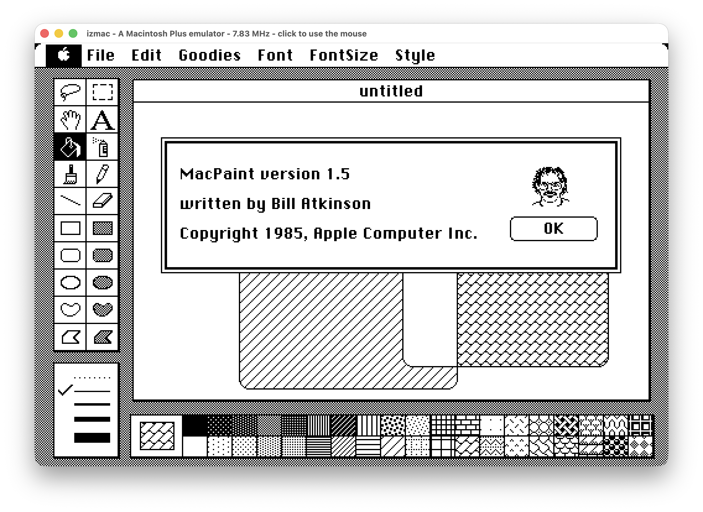

# izmac

A Macintosh Plus emulator written in Go for macOS, Windows and Linux. Built on
[iz68000](https://github.com/ivanizag/iz68000).



It runs the real ROM and the real software: the processor, the memory, the
video and the sound, the clock with its parameter RAM, the keyboard and the
mouse, the SCSI bus with up to seven disks on it, and both diskette drives,
reading, writing and formatting. The clipboard is shared with the host. The
serial ports are not there, so nothing that needs one works.

The development was assisted by Claude Code based on the architecture of my previous similar pre-AI projects [izapple2](https://github.com/ivanizag/izapple2), [iz6502](https://github.com/ivanizag/iz6502) and [bbz](https://github.com/ivanizag/bbz)

## Installing

No installation required. [Download](https://github.com/ivanizag/izmac/releases)
the archive for Linux, Windows or macOS and run the single executable inside.

On macOS it can also be installed with homebrew:

```bash
brew install ivanizag/tap/izmac
```

## Running it

izmac with no arguments comes up on MacPaint 1.5, downloading the ROM and a
disk image the first time and keeping both:

```
izmac
```

Or just put the fisk images you want to run, the emulator will automatically what they are, floopies, hard disk images or disk partitions and mount them:

```bash
izmac system.img games.dsk
```

Point at the window and the machine points where you point. **F10** opens the
emulator's menu.

## The manual

More info in the [manual](doc/manual.md) .

| | |
|---|---|
| [The manual](doc/manual.md) | installing izmac, the first run, and what the machine is |
| [Disks and diskettes](doc/disks.md) | where the software comes from, and how to put it in |
| [Keyboard, mouse and the menu](doc/controls.md) | driving the machine and driving the emulator |
| [Command line options](doc/options.md) | every option of both frontends |
| [Speed, the clock and the tracers](doc/advanced.md) | the emulator's own knobs, and the debugging tools |
| [When something goes wrong](doc/troubleshooting.md) | the failures worth recognising |

## Building it

You need [Go](https://go.dev/dl/) 1.26 or newer:

```bash
go run ./frontend/macebiten mydisk.img
```

[Running from the source](doc/manual.md#running-from-the-source) in the manual
has the rest of it, and `doc/plan.md` has the hardware notes and the design
decisions behind the emulator.

## References

- Inside Macintosh*, volume III, chapter 2, "The Macintosh Hardware",
  pages III-17 to III-46, refered as *the book* on the comments.
- Guide to the Macintosh Family Hardware*, 2nd edition
- [mac_rom](https://github.com/jonathanschilling/mac_rom), Jonathan
  Schilling's commented and buildable disassembly
- [Mini vMac](https://www.gryphel.com/c/minivmac/) 
- The `mac128` driver of MAME


While runnng, izmac optionally fetches:
- The ROM from The Internet Archive: [Macintosh ROM archive](https://archive.org/details/mac_rom_archive_-_as_of_8-19-2011)
- MacPaoint 1.5 from The Internet Archive: [MacPaint 1.5 diskette](https://archive.org/details/mac_Paint_2) 
- The scsi driver from MrGaaS's github: [blank formatted disks](https://github.com/MrGasS/Blank-SCSI-hard-disk-images-for-Macintosh)


