# Things to do with a Macintosh Plus

[Back to the manual](../manual.md)

izmac runs the real ROM and the real software of the Macintosh Plus, so it is a
way of finding out first hand what using one was like: what was on the screen,
what the machine could do, and how people did their work with it in the second
half of the eighties. These pages each take one thing a Macintosh user did then
and walk through it, step by step, with what you will see on the way.

Each page says what you need. Some need nothing but izmac, which downloads the
ROM and the MacPaint diskette by itself the first time it runs; the rest say
which disks to download, from izmac's repository or the Internet Archive.

## First steps

### [The 1984 experience](first-steps.md)

<a href="first-steps.md">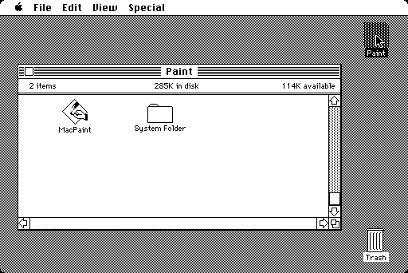</a>

Start izmac with nothing and you are where a new Macintosh owner was: a
diskette, a desktop and a mouse. Open the disk, pull down the menus, try a desk
accessory, look at a file with Get Info, throw something in the Trash and shut
the machine down, the way the Finder of 1985 has you do it.

### [Desk accessories and the Clipboard](desk-accessories.md)

<a href="desk-accessories.md">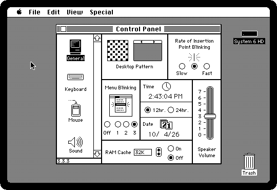</a>

The small programs of the Apple menu that opened over any application in a
machine that ran one at a time, and Cut, Copy and Paste carrying a sum from
the Calculator into a letter, and text from your own computer.

### [Life with diskettes](floppies.md)

<a href="floppies.md">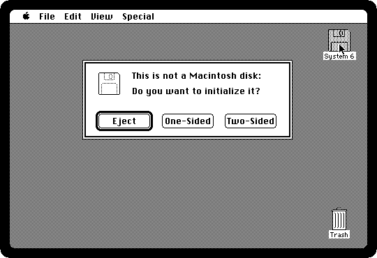</a>

One drive and a pile of 800K diskettes: a blank one initialized, a file copied
from one to another with the Macintosh asking for each in turn, and a diskette
put away in the Trash.

### [From System 2 to System 7](systems.md)

The same Macintosh Plus started with four Systems of four periods, from the
flat diskettes of 1985 to System 7, and what each Finder shows of itself.

## Work

### [Writing a letter in MacWrite](macwrite.md)

What you see is what you get: a letter typed, its title tried in the fonts of
the System, and printed on the ImageWriter exactly as it is on the screen.

### [Drawing in MacPaint](macpaint.md)

<a href="macpaint.md">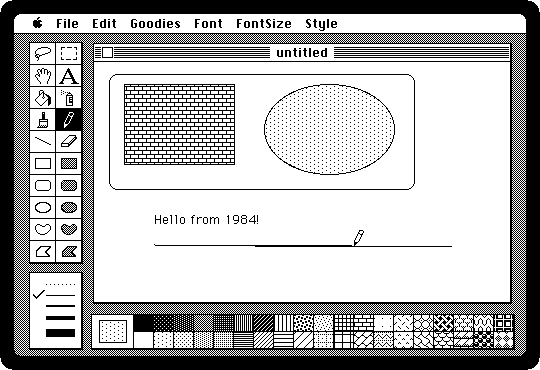</a>

The program that sold the Macintosh: shapes filled with patterns, text in the
picture, FatBits to edit it a dot at a time, and the drawing printed on an
ImageWriter, whose page comes out as an image on your computer.

### [A spreadsheet in Multiplan](spreadsheet.md)

<a href="spreadsheet.md">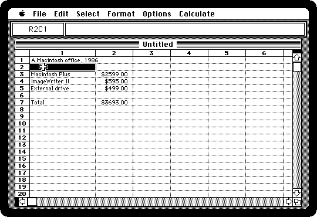</a>

One of Microsoft's first programs for the Macintosh: a budget of 1986 in rows and
columns, a total that is a formula, and every number worked out again when
one changes.

### [Printing on the ImageWriter](printing.md)

<a href="printing.md">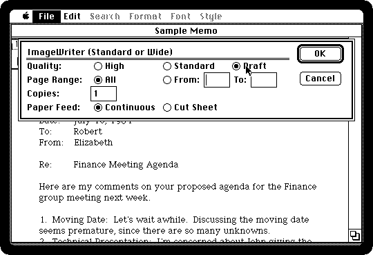</a>

The dot matrix printer beside every Macintosh: Choose Printer, Page Setup, and
the same memo printed in draft, standard and high quality, side by side.

## Making things

### [Programming in BASIC](basic.md)

<a href="basic.md">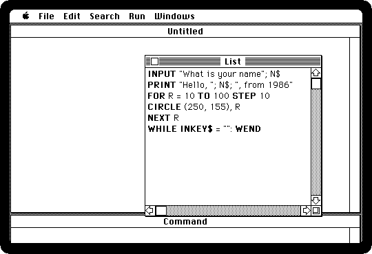</a>

Microsoft BASIC, the language of the home computers with the windows and the
drawing of the Macintosh: a short program that asks a name and draws circles.

### [HyperCard](hypercard.md)

<a href="hypercard.md">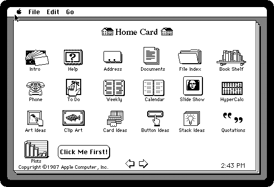</a>

The program that came with every Macintosh from 1987: its stacks browsed, and
then a stack of your own with a button and a HyperTalk script.

### [Changing a program with ResEdit](resedit.md)

<a href="resedit.md">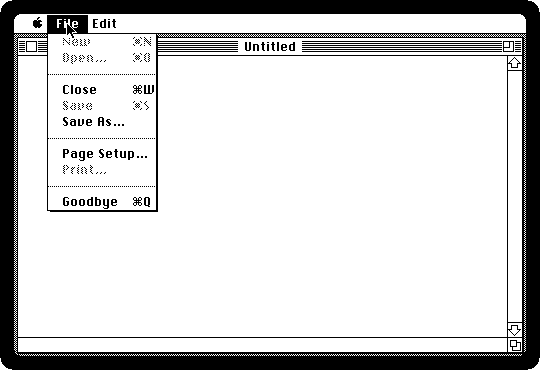</a>

The menus, icons and words of a program are its resources, apart from its
code: TeachText opened in ResEdit and one of its menus changed.

### [Writing a game in THINK Pascal](think-pascal.md)

Pascal was the language of the Macintosh: THINK Pascal 4.0 installed on a
hard disk, and the game 2048 written in it from nothing, run, and built into
an application of its own.

## The machine

### [MultiFinder](multifinder.md)

<a href="multifinder.md">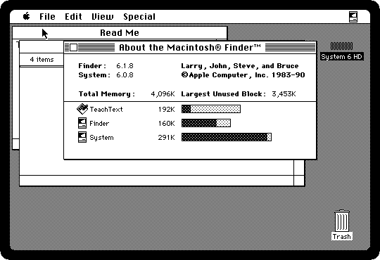</a>

More than one program at a time, from System 5 on: TeachText and the Finder
side by side, switched between with a click, and the memory each one takes.

### [Installing System 6 on a hard disk](installing.md)

<a href="installing.md">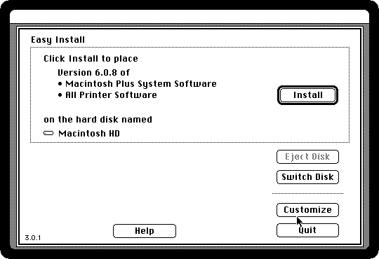</a>

An empty hard disk made a startup disk: formatted with HD SC Setup, System 6
installed from its four diskettes, and the Macintosh started from it.

### [Software from the archives](archives.md)

<a href="archives.md">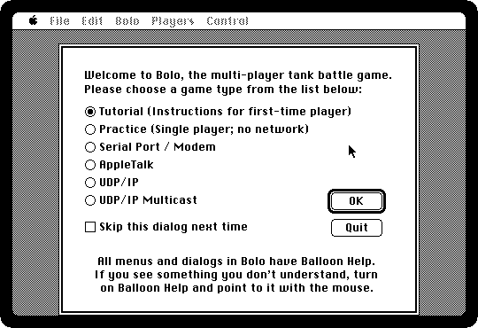</a>

A StuffIt archive as it was uploaded decades ago, given to izmac as it
is: Bolo, the tank game of the AppleTalk networks of universities.

## Networks

### [Your computer as a file server](file-server.md)

<a href="file-server.md">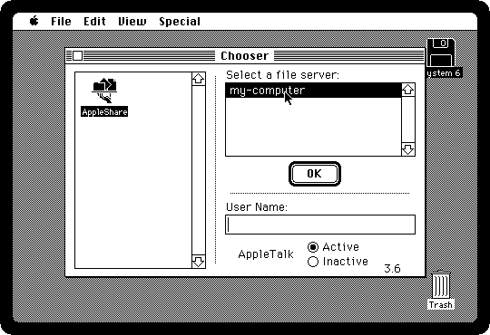</a>

A folder of your computer served to the Macintosh as an AppleShare file
server: found in the Chooser, mounted, and files going both ways.

### [Two Macs sharing files](file-sharing.md)

<a href="file-sharing.md">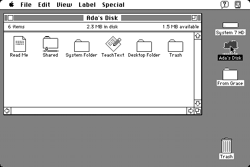</a>

Two Macintoshes on a LocalTalk network, each with System 7: one shares its disk
with the File Sharing of 1991, and the other connects to it from the Chooser
and copies a folder into it. Two izmacs on your computer, joined by the
emulated network.

## Play

### [Lode Runner](lode-runner.md)

<a href="lode-runner.md">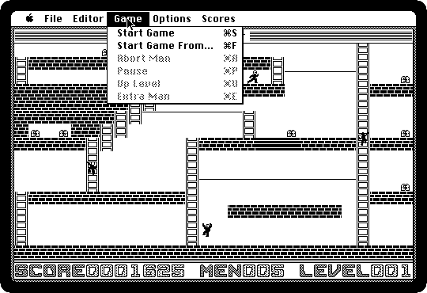</a>

Broderbund's game of 1983: a runner, ladders, gold and guards, and a gun that
digs holes in the bricks. It plays its first level by itself.

### [Dark Castle](dark-castle.md)

<a href="dark-castle.md">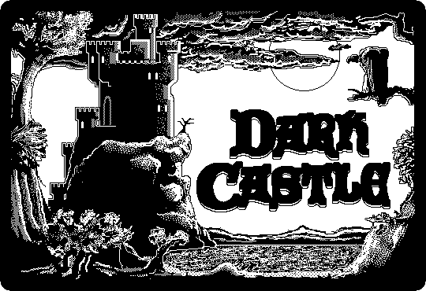</a>

The game of 1986 people bought a Macintosh to play, drawn like an old
engraving, with its demonstration of the rooms of the castle.
