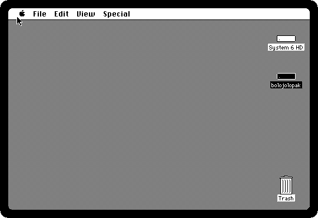
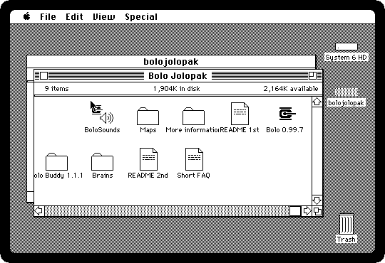
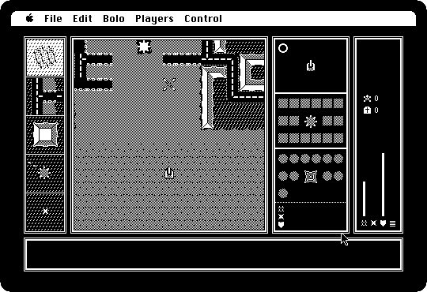

# Software from the archives

[Back to the activities](README.md)

Most Macintosh software after the first years did not reach its users in a
box. Shareware and freeware went around on bulletin boards, on the disks of
user groups, and later on the FTP servers of universities, and to fit down a
modem line a program was squeezed into an **archive**: StuffIt from 1987
onwards, with BinHex around it when it had to pass through e-mail. Downloading
was the easy half; on the Macintosh the archive then had to be opened with
the right program, of the right version, to get the program out.

The archives of those years are still around, at the Internet Archive among
other places, as they were uploaded. izmac opens them itself, so a
download goes to the Macintosh as it is. This is one: **Bolo**, the tank game
Stuart Cheshire wrote for the BBC Micro in 1987 and brought to the Macintosh
in 1989, which a generation of students played over the AppleTalk network of
their university.

## What you need

- **`system6.img`**, System 6 on a small hard disk, from izmac's repository:
  open
  [test_images/system6.img](https://github.com/ivanizag/izmac/blob/main/test_images/system6.img)
  and click *Download raw file*.
- **Bolo**, as the Tucows archive of shareware kept it: open
  [the Bolo page of the Internet Archive](https://archive.org/details/tucows_205988_Bolo)
  and download **`bolojolopak.sit`** from its files. It is Bolo 0.99.7 of
  1998, with the help programs of its players, StuffIt 5.
- For StuffIt archives, **unar**, from The Unarchiver: `brew install unar` on
  macOS, `unar` in the package manager of most Linux distributions. izmac
  opens zip, BinHex and MacBinary itself, and hands StuffIt to unar.

## Open the archive

1. **Start izmac with the System and the archive**, and four megabytes:

   ```bash
   izmac -ram 4096 system6.img bolojolopak.sit
   ```

   izmac says what it did with the archive:

   ```
   Unpacking bolojolopak.sit, a StuffIt 5 archive
     Packing 68 files on a new volume, bolojolopak
     + bolojolopak, a bare HFS volume of 4096Kb, in memory
   ```

   The files that were in it, with what makes them Macintosh files, their
   resource forks and their types, are on a disk of their own.

2. **That disk is on the desktop**, under the System's, with the name of
   the archive.

   

3. **Open it, and the folder in it.** These are the files as the author put
   them in the archive: the game, its sounds, maps, the *Brains* that drive
   the computer's tanks, and the read me files.

   

## Play

4. **Double-click Bolo 0.99.7.** It asks what kind of game: alone, against the
   computer, or with other players over a serial cable, AppleTalk or the
   Internet.

   

5. **Click Practice and OK**, and OK again to the options of the game. The
   map is an island, the tank is the one in the middle of the view, and the
   panels around it are the map in small, the pillboxes and bases, and the
   tank's shells, mines, armour and trees.

6. **Drive.** **Q** goes faster and **A** slower, **O** and **P** turn left
   and right, and the space bar fires.

   

   *Players* and *Control* in the menus have the rest; the read me files on
   the disk explain the game.

## Keep it

7. The disk the archive was unpacked on is in memory, and goes when izmac
   stops, with whatever the Macintosh wrote on it: a game saved, preferences.
   To keep it, start izmac with `-persist`:

   ```bash
   izmac -persist -ram 4096 system6.img bolojolopak.sit
   ```

   The disk is kept as `izmac_bolojolopak.dsk` in the folder izmac runs in,
   and used instead of the archive from then on. [Disks and
   diskettes](../disks.md#archives) has the rest of what izmac does with
   archives.

## What next

Bolo was made for the network: [Two Macs sharing
files](file-sharing.md) shows how to put two izmacs on one LocalTalk, and
the AppleTalk game type of Bolo works between them. [Games of the
Plus](games.md) has more to play.
