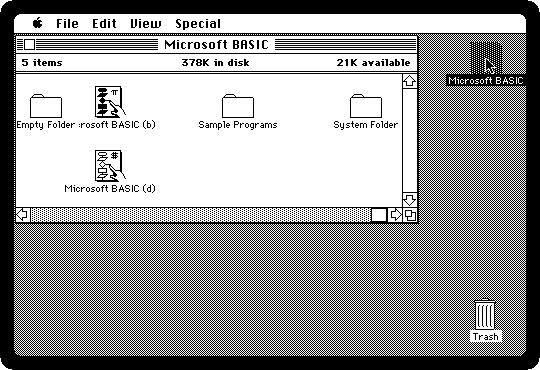
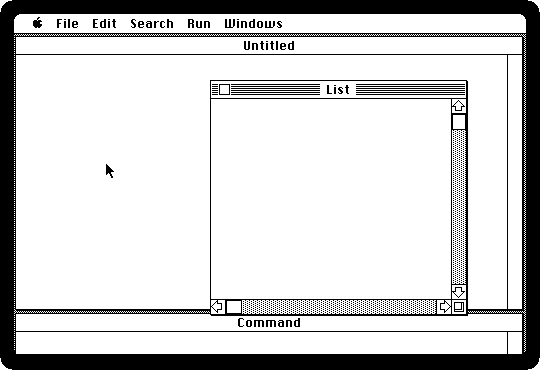
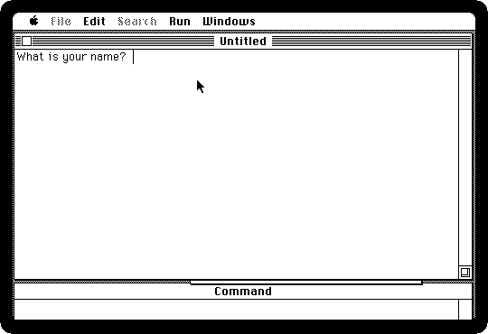

# Programming in BASIC

[Back to the activities](README.md)

Most home computers of the early eighties started in BASIC: switch one on, and
there was a prompt waiting for a program. The Macintosh did not, and had no
language in the box at all. Apple had its own BASIC for it nearly finished,
MacBASIC, and dropped it in 1985: the Apple II had come with Microsoft's
BASIC, Applesoft, since the late seventies, the licence for it was running
out, and Microsoft made dropping MacBASIC part of renewing it. So the BASIC
of the Macintosh was **Microsoft BASIC**: the language of the home computers,
with windows, the mouse, menus and QuickDraw's drawing within reach of a line
of code.

This is a short program typed and run in Microsoft BASIC 2.0, of 1985.

## What you need

**`basic.dsk`**, the Microsoft BASIC diskette, with its own System: from
izmac's repository, open
[test_images/basic.dsk](https://github.com/ivanizag/izmac/blob/main/test_images/basic.dsk)
and click *Download raw file*. It is the
[Microsoft BASIC 2.00 diskette](https://archive.org/details/mac_MSBASIC_2) of
the Internet Archive.

## Start BASIC

1. **Start izmac with the diskette**, and open it:

   ```bash
   izmac basic.dsk
   ```

   There are two BASICs on it. *Microsoft BASIC (d)* counts in decimal, so
   that money adds up to the cent; *Microsoft BASIC (b)* counts in binary,
   which is faster for everything else. The *Sample Programs* folder has a
   few to load and run.

   

2. **Double-click Microsoft BASIC (d).** Three windows: the program goes in
   **List**, the window behind it, *Untitled*, is where the program writes
   and draws, and **Command** at the bottom runs a line straight away.

   

## Write a program

3. **Type the program** in the List window, a line at a time, each ended with
   Return:

   ```basic
   INPUT "What is your name"; N$
   PRINT "Hello, "; N$; ", from 1986"
   FOR R = 10 TO 100 STEP 10
   CIRCLE (250, 155), R
   NEXT R
   WHILE INKEY$ = "": WEND
   ```

   It asks a name and greets it, draws ten circles, one inside the other,
   around the point 250 across and 155 down, and waits for a key. BASIC
   writes the words it knows in bold as you type them.

   

   Lines without numbers were new: the BASICs before needed one at the start
   of each line, and this one only needs a number or a label on a line a
   GOTO goes to.

## Run it

4. **Close the List window**, with the box at its top left, so that it does
   not cover the drawing, and **choose Start from the Run menu**, or press
   Command-R. Type a name when it asks, and press Return.

   

   Press any key to end it. The List window comes back, to change the
   program and run it again.

5. **Save it** with Save As from the File menu, onto the diskette.

## What next

[HyperCard](hypercard.md) was the programming that came with every Macintosh
from 1987, and [ResEdit](resedit.md) is how a program's menus and pictures can
be changed without programming at all.
