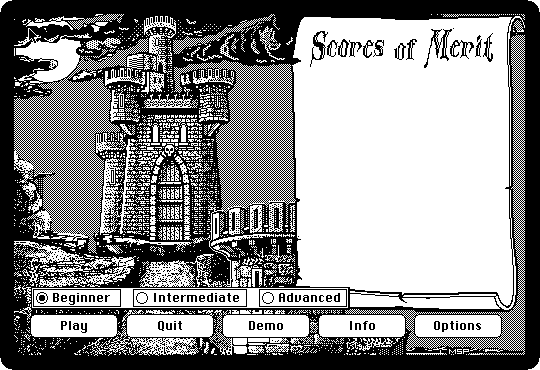
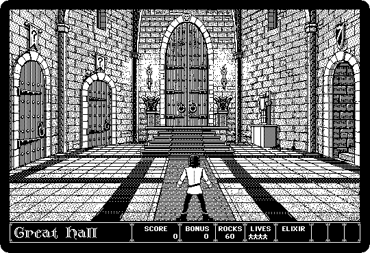

# Dark Castle

[Back to the activities](README.md)

**Dark Castle** came out in 1986, from Silicon Beach Software, and it was one
of the games people bought a Macintosh to play. Its rooms are drawn in black
and white like the engravings of an old book, its hero moves as a person
does, and it played sampled sounds when most home computers beeped. The goal
is the Black Knight, at the top of the castle, through rooms full of rats,
bats and guards.

## What you need

**`darkcastle.dsk`**, from izmac's repository: open
[test_images/darkcastle.dsk](https://github.com/ivanizag/izmac/blob/main/test_images/darkcastle.dsk)
and click *Download raw file*. It is the
[Dark Castle 1.2 diskette](https://archive.org/details/mac_DarkCastle_1_2) of
the Internet Archive.

## Play

1. **Start izmac with the diskette**:

   ```bash
   izmac darkcastle.dsk
   ```

   There is no Finder on the diskette: the Macintosh starts straight into
   the game, with its title.

   

2. **Press a key.** The castle, the scores, and the buttons: *Play*, the
   level of the game, and **Demo**.

   

3. **Click Demo.** The game shows its rooms, the Great Hall and the doors that
   go to the other parts of the castle, and the hero climbing and throwing
   rocks at what comes at him.

   

4. **Click Play** to play it. The keyboard moves the hero and the mouse aims
   the rocks, and the door he goes through first decides which part of the
   castle he is in. *Info* tells how to play.

## What next

[Lode Runner](lode-runner.md) is the other game here, and [Software from the
archives](archives.md) has Bolo, the tank game of the AppleTalk networks.
