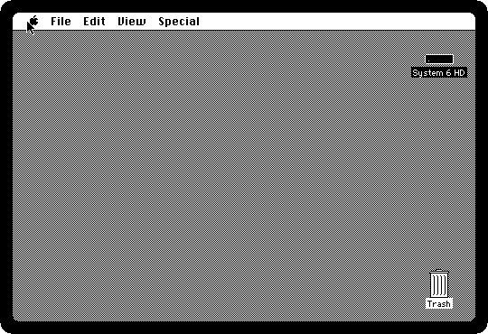
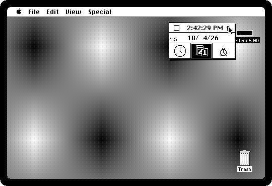
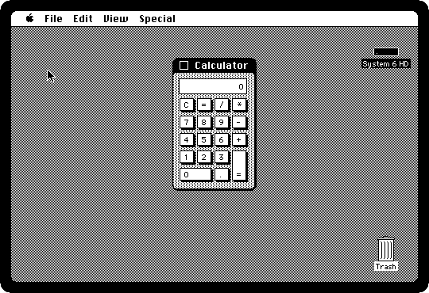
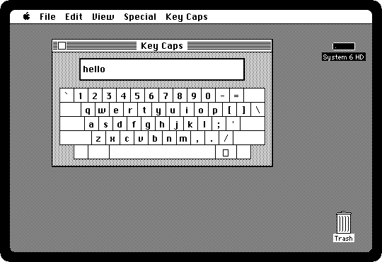
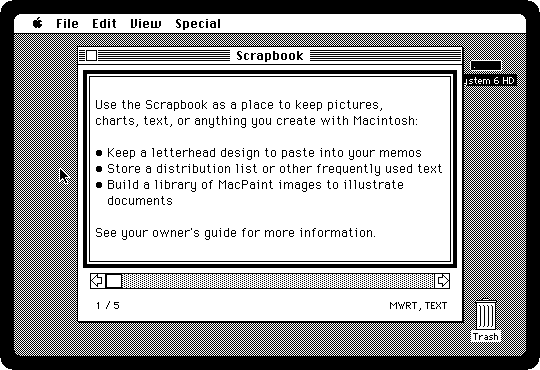
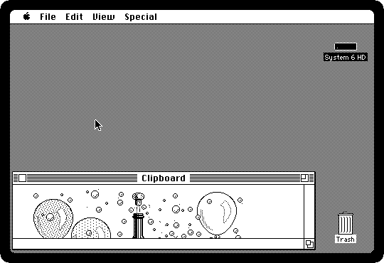
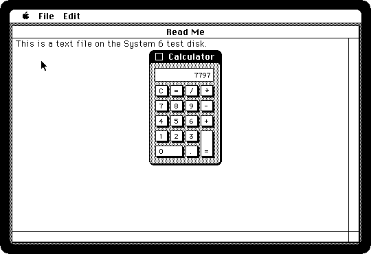
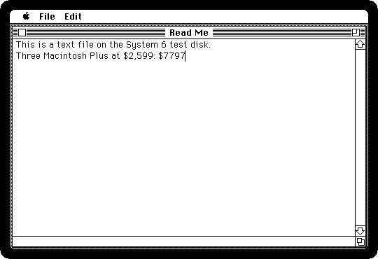
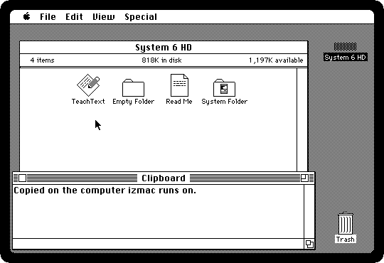

# Desk accessories and the Clipboard

[Back to the activities](README.md)

The Macintosh ran one application at a time. Quitting it to look something up
meant saving, waiting for the diskette, and starting it again afterwards. The
**desk accessories** were the way around that: small programs in the Apple
menu that open in a window of their own over whatever is running, the
Calculator over a letter, the Alarm Clock over a drawing, and close again
leaving the application as it was.

The **Clipboard** was the other half: Cut, Copy and Paste, in the same place
on the Edit menu of every application, carried text and pictures from one
program to another, through the desk accessories too. Both were there from
the first Macintosh, and this is them on System 6.0.8, from 1991, the last
System of many Plus owners.

## What you need

A hard disk with System 6 on it. izmac's own tests use one, a small one with
TeachText and the desk accessories of the System: download **`system6.img`**
from izmac's repository, by opening
[test_images/system6.img](https://github.com/ivanizag/izmac/blob/main/test_images/system6.img)
and clicking the download button, *Download raw file*.

## The desk accessories

1. **Start izmac with it**, and wait for the Finder:

   ```bash
   izmac system6.img
   ```

2. **Pull down the Apple menu.** Under *About the Finder* are the desk
   accessories of this System: the Alarm Clock, the Calculator, the Chooser,
   which picks the printer, the Control Panel, Find File, Key Caps and the
   Scrapbook.

   

   Which ones a System had was up to its owner: Font/DA Mover, on the
   Utilities 2 diskette, took them out of the System file and put new ones in.

3. **Choose the Alarm Clock**, and click the little flag at its right. It
   opens out into the clock, the date and the alarm, each set by clicking its
   icon and the numbers.

   

   Close it with the box at its top left. A desk accessory is closed that way
   in the Finder: there is no Close of its own in the menus.

4. **Choose the Calculator**, and type a sum on the keyboard, *2599\*3=*. The
   keys of the Calculator follow the keys you press. $2,599 was the price of a
   Macintosh Plus when it came out in 1986.

   

5. **Choose Key Caps**, and type. The keys light up as you press them and
   what you type appears at the top. Hold the **Option** key down, Alt on a
   PC keyboard: the keyboard shows the characters Option gives, the accents,
   the symbols, the © and the ™ that a typewriter never had.

   

6. **Choose the Control Panel.** Its icons on the left are the parts of the
   machine: the general settings, the keyboard, the mouse and the sound. The
   general ones are the desktop pattern, edited a dot at a time in the square
   on the left, how fast the insertion point blinks, the clock, and the
   speaker volume.

   

7. **Choose the Scrapbook**, and go through it with the arrow at the right of
   its scroll bar: a place to keep pictures and text to paste in later, a
   page each. The five that come with the System are a note on what it is
   for, a chart, an organization chart, a heading for memos and a party.

   

## The Clipboard

8. **On the last page, choose Copy from the Edit menu**, and close the
   Scrapbook. The picture is on the Clipboard now. **Choose Show Clipboard
   from the Edit menu** of the Finder to see it.

   

   The Clipboard holds one thing at a time, whatever was copied last. The
   Scrapbook is where to keep more.

9. **Open the disk and double-click Read Me**: TeachText, the little text
    editor that came with the System, opens it. Then **choose the Calculator
    from the Apple menu**, over TeachText, and type *2599\*3=* again.

    

    The Calculator is in front, and TeachText is still there behind it,
    with its document as it was.

10. **Choose Copy from the Edit menu.** The menu is TeachText's, and the copy
    is the Calculator's: a desk accessory works the Edit menu of whatever
    application it opened over. Close the Calculator, click at the end of the
    text, press Return, type a few words and **choose Paste**.

    

## With your computer

11. izmac shares the Clipboard with your computer. Copy some text on your
    computer, click on the izmac window, and the text is on the Clipboard of
    the Macintosh: quit TeachText without saving, and **Show Clipboard** in
    the Finder shows it.

    

    And the other way: copy text on the Macintosh, and it is on the clipboard
    of your computer. Only text crosses, not pictures.

    TeachText, like many applications, keeps a Clipboard of its own while it
    is running and only reads the Macintosh's when it starts, so text from
    your computer reaches it if it was copied before TeachText was opened.
    [Keyboard, mouse and the menu](../controls.md#copy-and-paste) has the rest,
    and the F11 key that hands your clipboard over at any time.

## What next

[MultiFinder](multifinder.md) is the way out of one application at a time
that System 6 brought, and [Writing a letter in MacWrite](macwrite.md) is the
kind of application all this was used around.
