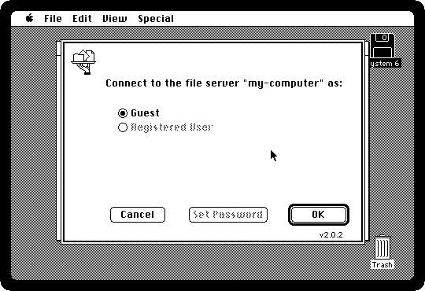
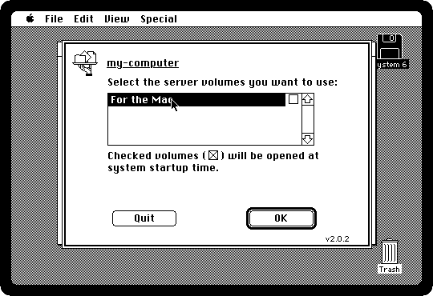
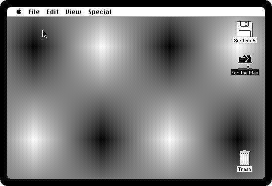
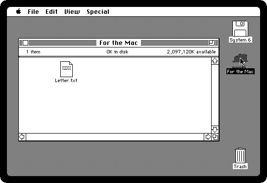
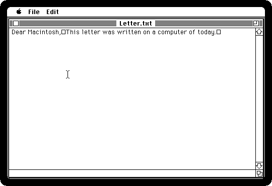
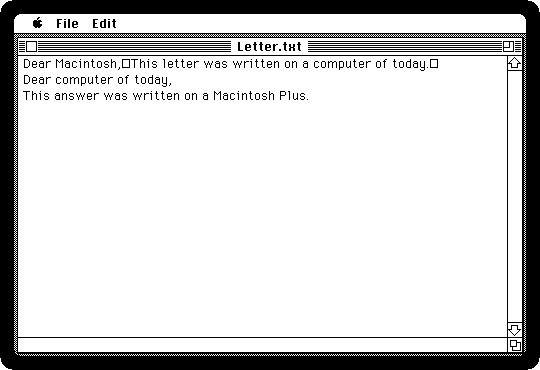
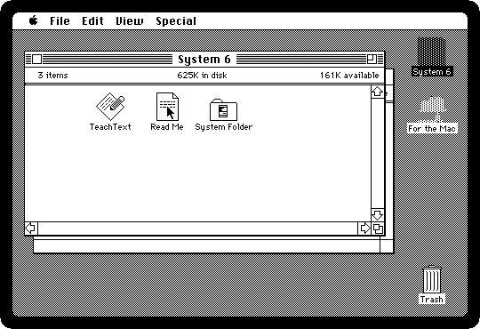

# Your computer as a file server

[Back to the activities](README.md)

In an office of the late eighties the files everybody needed were on a **file
server**: a Macintosh in a corner, often with a big hard disk, running
AppleShare, Apple's file server software of 1987. The others reached it
over the LocalTalk cable, from the Chooser, and its disk appeared on their
desktops like one of their own, to open, save and copy to.

izmac has a file server of that kind in it. Give it a folder of your computer,
and the Macintosh finds it in the Chooser and mounts it, so that files go
between the two, the way they went between a Macintosh and the server down
the corridor.

## What you need

- **`system6.dsk`**, System 6 on a diskette with the AppleShare part of the
  Chooser on it, from izmac's repository: open
  [test_images/system6.dsk](https://github.com/ivanizag/izmac/blob/main/test_images/system6.dsk)
  and click *Download raw file*.
- **A folder to share**, called *For the Mac*, with a text file in it,
  *Letter.txt*, written with any text editor of your computer.

## Find the server

1. **Start izmac with the folder shared**, and four megabytes:

   ```bash
   izmac -ram 4096 -share "For the Mac" system6.dsk
   ```

   `-share` turns AppleTalk on and puts the server on it, named after your
   computer. In the pictures here it is *my-computer*.

2. **Choose the Chooser from the Apple menu**, and click **AppleShare** on
   the left. The servers on the network are listed on the right: click
   yours.

   

3. **Click OK**, and log in as a **Guest**, with OK again. A real server had
   registered users with passwords; this one lets in anyone who can see it,
   which here is only your Macintosh.

   

4. **Click the folder** in the list of the server's volumes, and OK. The box
   beside it would mount it every time the Macintosh starts.

   

5. **Close the Chooser.** The folder is on the desktop, with the icon of a
   disk on the network.

   

## Files both ways

6. **Double-click it.** Its window has what the folder has on your computer.

   

7. **Double-click Letter.txt.** It is a text file, so TeachText opens it.

   

   The boxes are the ends of the lines. Computers of today end a line with a
   *line feed*, and the Macintosh ended it with a *carriage return*: to
   TeachText a line feed is a character it has no picture for.

8. **Click at the end, press Return and write an answer.** Then **choose Save
   from the File menu** and quit TeachText.

   

   Open *Letter.txt* on your computer: the answer is there, saved by the
   Macintosh into your folder, with the carriage returns of the Macintosh at
   the ends of its lines. Most editors of today read both.

9. **Open the System diskette and drag Read Me onto the folder.** It is
   copied over the network into your folder.

   

   On your computer the folder has *Read Me* now, and beside it a file
   called `._Read Me`. That is where izmac keeps what a Macintosh file has
   that a file of today has not: its type and creator, which say what it is
   and which application opens it, and its resource fork. Keep the two
   together when you copy the file somewhere else, and give the folder to
   izmac again, and it is the same Macintosh file.
   [AppleTalk](../appletalk.md#sharing-a-folder) has more.

## What next

[Two Macs sharing files](file-sharing.md) is the same thing between two
Macintoshes, with the File Sharing of System 7, and [Software from the
archives](archives.md) is another way to get files into the Macintosh.
