# Two Macs sharing files

[Back to the activities](README.md)

Every Macintosh had a network built in. The printer port spoke AppleTalk, and a
cable from one Macintosh to the next, LocalTalk, made a network of them at 230
kilobits a second, enough to share a LaserWriter, which was what most offices
bought it for. Sharing files took a file server, a Macintosh running AppleShare,
until System 7 in 1991 gave every Macintosh **File Sharing**: any of them could
share its disk with the others, and any of them could use what the others
shared, from the Chooser.

This is two Macintoshes in an office: Ada's, which shares its disk, and Grace's,
which connects to it and puts a folder in it. Both are izmacs on your computer,
on one emulated LocalTalk.

## What you need

A disk with System 7 and File Sharing installed for each Macintosh. izmac's own
tests use one, System 7.1.2 on a 4 MB hard disk, made from the
[MacPack](https://archive.org/details/macpack) at the Internet Archive; download
it twice, one for each:

```bash
curl -L -o ada.img https://github.com/ivanizag/izmac/raw/main/test_images/system7.img
curl -L -o grace.img https://github.com/ivanizag/izmac/raw/main/test_images/system7.img
```

Each Macintosh needs its own disk image, since two machines writing to the same
file would ruin it, and its own parameter RAM file, which is where a Macintosh
remembers its settings, its address on the network among them.

## Start both

1. Start Ada's Macintosh, in a terminal:

   ```bash
   izmac -appletalk host -ram 4096 -pram ada.pram ada.img
   ```

   and Grace's, in another:

   ```bash
   izmac -appletalk host -ram 4096 -pram grace.pram grace.img
   ```

   `-appletalk host` puts the printer port of each on a LocalTalk shared by all
   the izmacs started that way on this computer, and `-ram 4096` gives each the
   four megabytes that were the most a Plus could have, which System 7 makes
   good use of. The first time, your computer may ask whether
   izmac can accept network connections: say yes.
   [AppleTalk](../appletalk.md) has the other ways of connecting them.

## Share Ada's disk

The steps in this part are on **Ada's** Macintosh.

2. **Open the disk**: double-click its icon at the top right, *System 7 HD*.
   Then **rename it**, so that the two disks can be told apart from Grace's
   side: click its name under the icon, wait a moment for it to become a box,
   type *Ada's Disk* and press Return.

   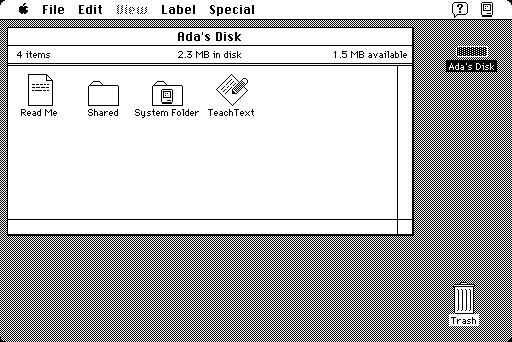

3. **Open the System Folder, then Control Panels**, with a double click each.
   The control panels are the settings of System 7, each a small program of
   its own.

   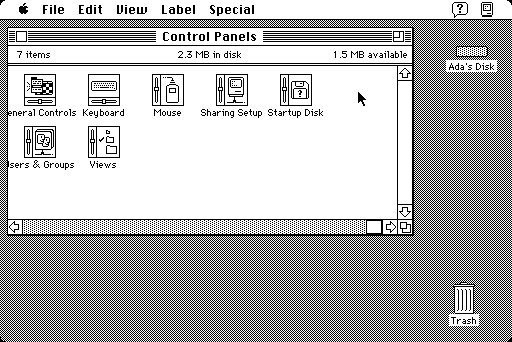

4. **Open Sharing Setup.** It says who owns the Macintosh and what it is
   called on the network.

   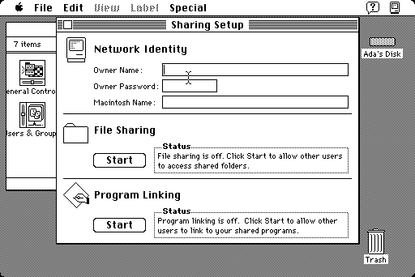

   Type the **owner name**, *Ada*, press Tab, a **password**, *secret*, press
   Tab, and the **Macintosh name**, *Ada's Mac*. Then click **Start** under
   File Sharing. Starting takes about a minute on a Macintosh Plus, and when
   it is done the button says *Stop*.

   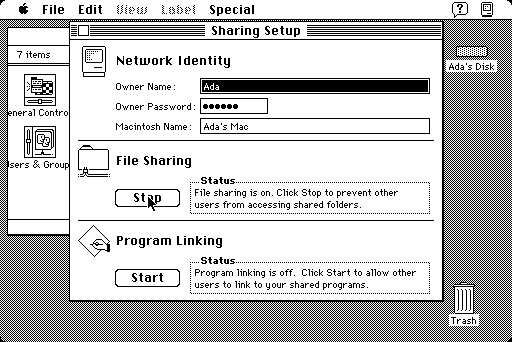

5. Close Sharing Setup, the Control Panels and the System Folder, with the box
   at the top left of each, to be back at the window of the disk.

6. **Share the folder called Shared**: click it once to select it, and choose
   **Sharing...** from the File menu. Tick *Share this item and its contents*.
   The boxes below say who may see the folders, see the files and make changes
   in it: the owner, a user or group of the ones *Users & Groups* in the Control
   Panels keeps, and everyone else.

   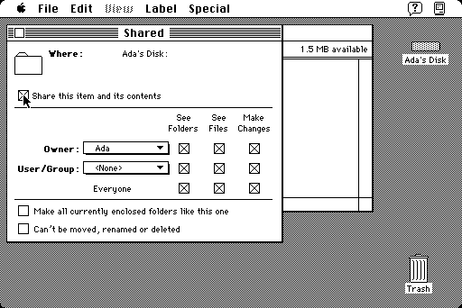

   Close the window and click **Save**. The folder's icon now has a tab under it
   and network cables coming out of it: it is shared. Open it, to see what
   arrives.

## Connect from Grace's

The steps in this part are on **Grace's** Macintosh.

7. **Choose Chooser from the Apple menu**, and click **AppleShare** on its left.
   Every file server on the network appears on the right: Ada's Mac is one.

   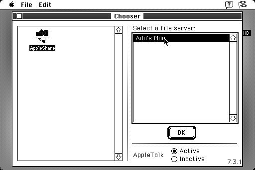

8. **Click Ada's Mac and OK.** Log in as a **registered user**, with the owner
   name and the password Ada typed in Sharing Setup: *Ada* and *secret*. Then
   click OK.

   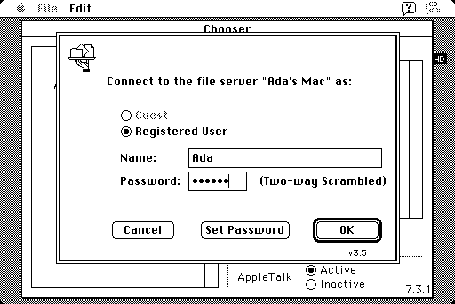

   The owner of a Macintosh can use all of its disk from another one. Anyone
   else would see only the folders shared with them.

9. **Choose the disk** in the list, *Ada's Disk*, and click OK. Then close the
   Chooser.

   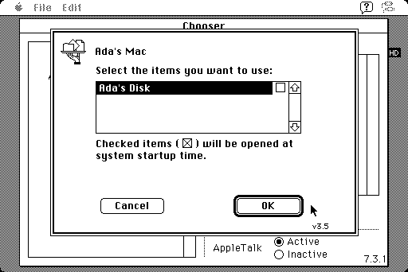

   Ada's disk is on Grace's desktop now, with the icon of a disk on the network,
   under Grace's own.

   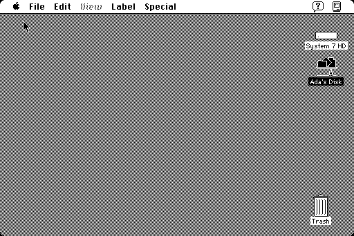

10. **Make a folder and copy it across**: choose New Folder from the File menu,
    type *From Grace* and press Return. A folder appears on the desktop. Then
    double-click Ada's disk to open it, and drag the folder onto *Shared*.

    

    The folder is copied over the network into Ada's shared folder.

    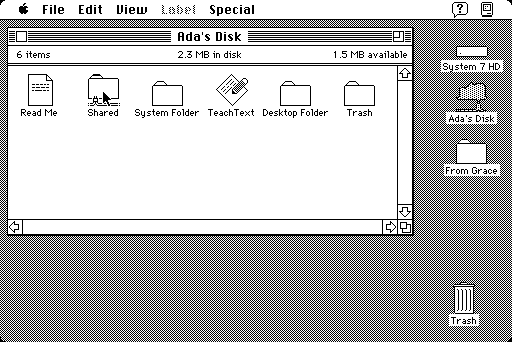

## Back on Ada's

11. The window of *Shared* on Ada's Macintosh has the folder Grace put in it.

    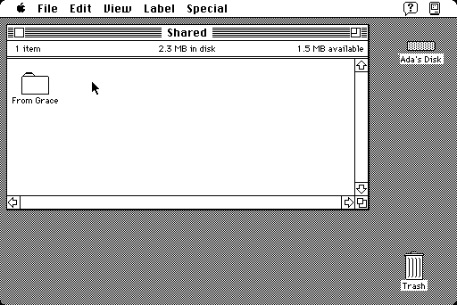

    That is the whole of it: two Macintoshes, one network cable, and each
    one's files on the other's desktop, which was new in 1991 and the way
    small offices shared their work for the rest of the decade.

## What next

izmac can be a file server itself, for a folder of your own computer: `-share`
puts it on the network, and a Macintosh connects to it from the Chooser the
same way. [AppleTalk](../appletalk.md) explains it.
