# The 1984 experience

[Back to the activities](README.md)

The Macintosh came in 1984 with a mouse, a desktop and windows, at a time when
almost every other computer greeted its owner with a blinking prompt. What a
new owner had in front of them was a diskette with a System Folder and an
application on it, and a manual that started by teaching how to hold the mouse.

This is that first afternoon. The diskette izmac starts with when you give it
nothing is MacPaint, from 1985, with System 2.0 and the Finder 4.1 on it, the
software of the Macintosh 512K and the first Macintosh Plus.

## What you need

Only izmac. The first time it runs it downloads the ROM of the Macintosh Plus
from the [Macintosh ROM
archive](https://archive.org/details/mac_rom_archive_-_as_of_8-19-2011) and the
[MacPaint diskette](https://archive.org/details/mac_Paint_2), both at the
Internet Archive, and keeps them beside itself for the next time.

## Start the Macintosh

1. Run izmac with no arguments, from a folder of its own:

   ```bash
   izmac
   ```

   After a few seconds of grey screen, while the diskette is read, the desktop
   appears:
   the menu bar at the top, the diskette, called *Paint*, at the top right, and
   the Trash at the bottom right.

   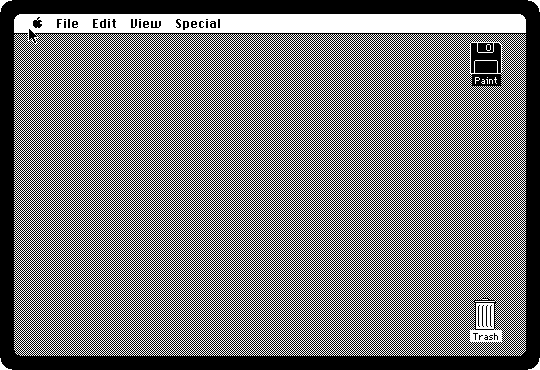

   Everything on the screen is pointed at with the mouse: point at something
   with your own mouse and the Macintosh's pointer goes there. A click selects,
   a double click opens, and holding the button down while moving drags.

2. **Double-click the diskette.** It opens into a window with what is on it:
   MacPaint and the System Folder. The line at the top of the window says how
   much is used and how much is left: a diskette of this machine held 400K,
   about the size of one photograph of today.

   

   Drag the window by its title bar to move it, the box at its bottom right to
   resize it, and click the box at its top left to close it. The scroll bars
   move what is inside when it does not fit.

## The menus

3. **Point at a word of the menu bar and hold the button down.** The menu
   drops down while you hold it, and what you let go over is chosen. Let go
   anywhere else and nothing is.

   The Apple menu, at the left, has *About the Finder* and the **desk
   accessories**: small programs that open over whatever is running. The
   Macintosh ran one application at a time, and the desk accessories were how
   you looked something up in the middle of something else.

   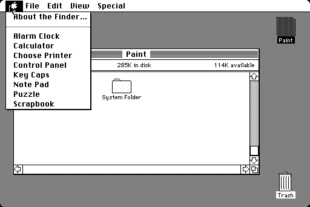

   *Choose Printer* is what became the Chooser a year later.

4. **Choose About the Finder.** The Finder is the program that draws the
   desktop, and this is its version: 4.1, by Bruce Horn and Steve Capps, with
   the memory of the machine at the bottom left. Click to close it.

   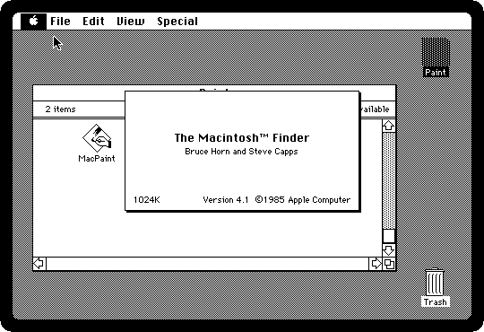

5. **Choose Puzzle from the Apple menu.** The fifteen puzzle, shuffled anew each
   time: click a tile next to the gap to slide it in. It is a desk accessory
   like the others, a window of its own that stays open over the Finder and over
   any application. Close it with the box at its top left.

   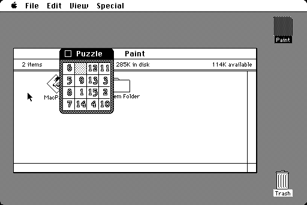

6. **Open the View menu.** A window shows its contents as icons, or as a list
   ordered by name, date, size or kind.

   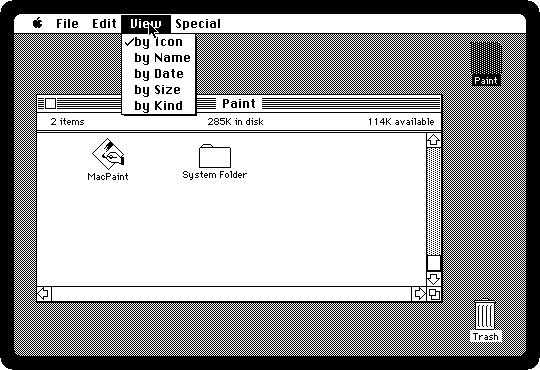

   **Choose by Name**, and the window turns into a list with the size, the kind
   and the date of each file. Choose *by Icon* to go back.

   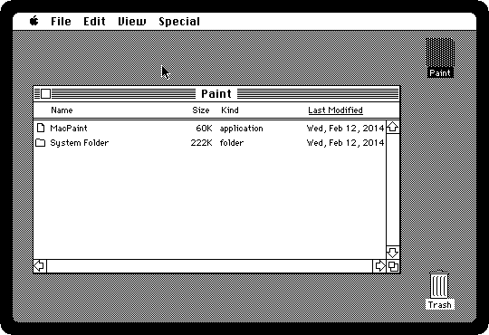

## Files

7. **Click MacPaint once, to select it, and choose Get Info from the File menu**
   (or press Command and I together: the Command key is the one with the
   clover, ⌘, and on your keyboard it is Command on a Mac, the Windows key on a
   PC, or Alt on either). The window says what the file is, how big, when it was
   made, and has a box for a comment of your own.

   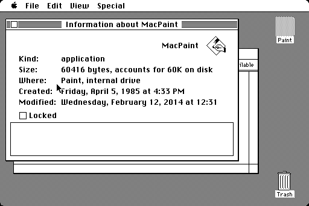

   Close it with the box at its top left.

8. **Choose New Folder from the File menu.** An *Empty Folder* appears in the
   window, ready to have files dragged into it.

   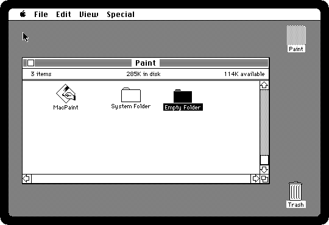

9. **Drag the new folder onto the Trash**, and let go when the Trash darkens.
   The Trash bulges: what is in it is not deleted yet, and can be dragged back
   out.

   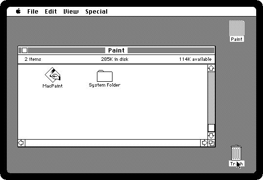

10. **Open the Special menu and choose Empty Trash.** Now it is gone.

    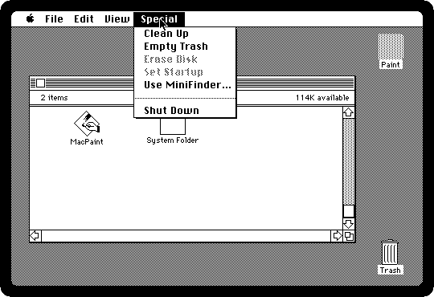

    *Use MiniFinder* is a smaller Finder that only lists the applications, for
    the days of switching between programs from one diskette to another.

## Turn it off

11. **Choose Shut Down from the Special menu.** The Finder puts away what it
    has open, ejects the diskette and restarts the machine, which waits with a
    blinking question mark for a disk to start from. That was the moment to
    reach for the switch at the back.

    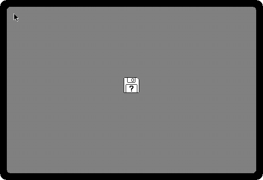

    Close the izmac window to switch it off. Later Systems put up a message that
    it is safe to switch off, and izmac closes by itself when they do.

## What next

The MacPaint on the diskette is the next page: [Drawing in MacPaint](macpaint.md).
[Keyboard, mouse and the menu](../controls.md) has more on the keys, the mouse,
and izmac's own menu, on **F10**.
