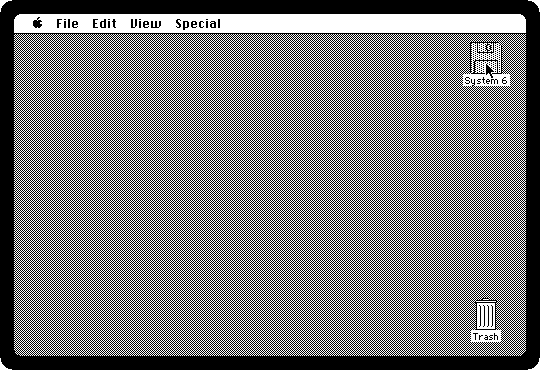
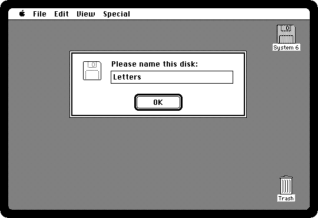
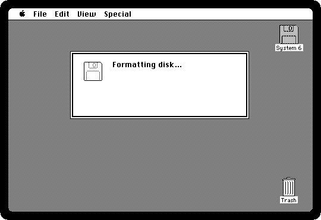
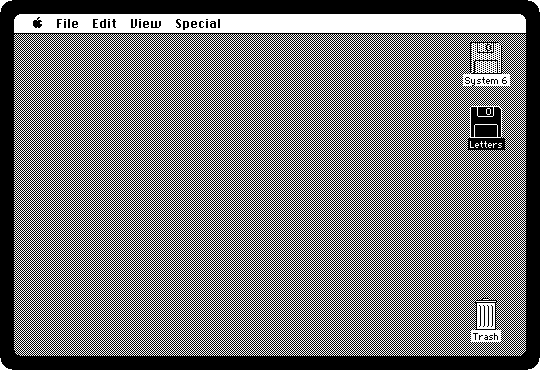
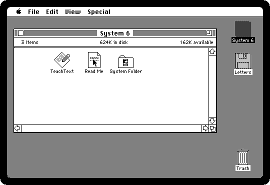
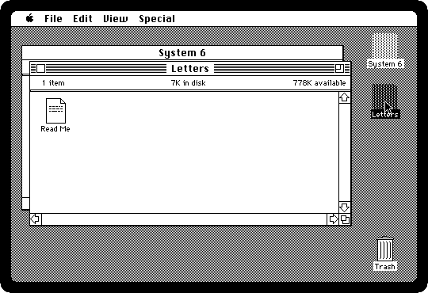
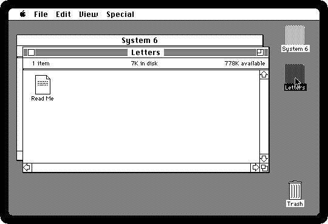

# Life with diskettes

[Back to the activities](README.md)

A Macintosh Plus came with one diskette drive, inside, for the 800K diskettes
it introduced, and most owners had nothing else: a second drive for the port
at the back cost extra, and Apple's hard disk, the HD 20, cost more than half
as much as the computer itself.
The System was on a diskette, the programs were on diskettes, and the work was
saved on diskettes, kept in boxes beside the machine.

With one drive the Macintosh handled more diskettes than drives by
remembering them. A diskette taken out stays on the desktop, dimmed, and
when something on it is wanted the Macintosh asks for it by name, ejects the
one in the drive, and waits for the other. Copying a file from one diskette to
another was a dance of putting them in and taking them out, which this page
goes through.

## What you need

- **`system6.dsk`**, System 6 on an 800K diskette, from izmac's repository:
  open
  [test_images/system6.dsk](https://github.com/ivanizag/izmac/blob/main/test_images/system6.dsk)
  and click *Download raw file*.
- **A blank diskette**: a file of 800K full of zeros. On macOS or Linux, in
  a terminal:

  ```bash
  dd if=/dev/zero of=blank.dsk bs=1024 count=800
  ```

  On Windows, in PowerShell:

  ```powershell
  [IO.File]::WriteAllBytes("$PWD\blank.dsk", (New-Object byte[] 819200))
  ```

## One drive, two diskettes

1. **Start izmac with the System diskette**:

   ```bash
   izmac system6.dsk
   ```

2. **Eject it**: click its icon, *System 6*, and choose **Eject** from the
   File menu, or press Command-E. The diskette comes out, and its icon stays,
   dimmed: the Macintosh still knows it, and knows it is not in the drive.

   

3. **Put the blank one in**: drag `blank.dsk` onto the izmac window. A new
   diskette has nothing on it the Macintosh can read, and it offers to
   initialize it.

   

   *One-Sided* makes a 400K diskette, the kind the first Macintosh used.
   *Two-Sided* is the 800K of the Plus.

4. **Click Two-Sided**, and **Erase** when it warns that the disk will be
   erased. Then **name it**: *Letters*, and OK.

   

   The drive formats it, a track at a time, and reads it all back to check.

   

5. *Letters* is on the desktop, under the dimmed System diskette.

   

## Copying with one drive

6. **Double-click the dimmed System diskette.** It is not in the drive, so
   the Macintosh ejects *Letters* and asks for it. Drag `system6.dsk` onto
   the window again, and its window opens.

7. **Drag Read Me onto the icon of Letters.** The Macintosh reads the file
   into memory, ejects the System diskette, and asks for *Letters* to write
   it. Drag `blank.dsk` onto the window, which is *Letters* now.

   

   A small file fits in memory in one go, so it takes one swap. A program
   bigger than the memory left took several, back and forth, each a diskette
   out and another in by hand, which is why the second drive was the first
   thing most owners bought.

8. **Open Letters**, and the Read Me is there.

   

## Putting a diskette away

9. **Drag Letters to the Trash.** It is not thrown away: the Trash is also
   how a diskette is ejected for good. Its icon goes, and the Macintosh
   forgets it, so it will not ask for it again.

   

   The diskette is `blank.dsk` on your computer, with Read Me on it now:
   izmac writes back to the file whatever the Macintosh writes on the
   diskette. Give it to izmac again and it is *Letters*.

## What next

[Installing System 6 on a hard disk](installing.md) is the way out of the
swapping, and [Disks and diskettes](../disks.md) is everything izmac does with
the images.
