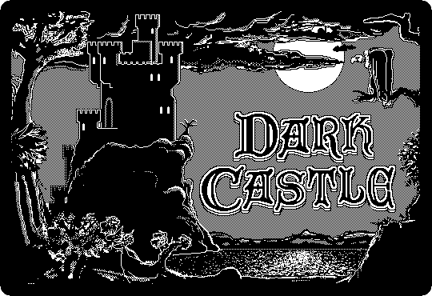
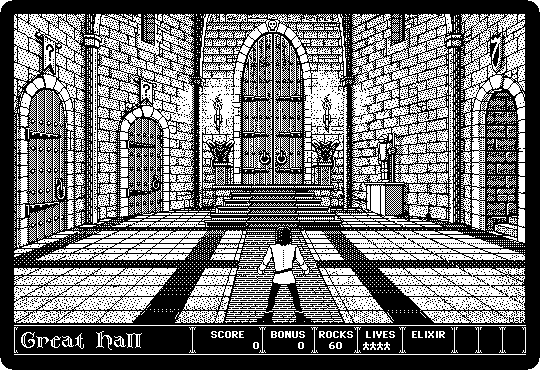

# Games of the Plus

[Back to the activities](README.md)

The Macintosh was sold as a serious machine for the office, and it was played
on all the same: a screen of 512 by 342 dots, sharper than any home computer
of the time, a mouse, and in black and white only, which the best games of it
turned into a style of their own, drawn like the engravings of an old book.

These are two of them, playing by themselves in the demonstrations they show
when nobody touches them: **Lode Runner**, Broderbund's game of 1983 on the
Macintosh, and **Dark Castle**, of 1986, by Silicon Beach Software, one of
the games people bought a Macintosh to play.

## What you need

From izmac's repository, open each and click *Download raw file*:

- [loderunner.dsk](https://github.com/ivanizag/izmac/blob/main/test_images/loderunner.dsk),
  the [Lode Runner diskette](https://archive.org/details/mac_Lode_Runner) of
  the Internet Archive;
- [darkcastle.dsk](https://github.com/ivanizag/izmac/blob/main/test_images/darkcastle.dsk),
  the [Dark Castle 1.2 diskette](https://archive.org/details/mac_DarkCastle_1_2)
  of the Internet Archive.

## Lode Runner

1. **Start izmac with the diskette**, and open it:

   ```bash
   izmac loderunner.dsk
   ```

   Besides the game there are two sets of levels: *Championship*, made
   harder, and *Revenge*.

   

2. **Double-click Lode Runner.** It plays its first level by itself: the
   runner collects the gold and the guards chase him. Run up the ladders,
   along the bars, and dig holes in the bricks for the guards to fall in;
   the *Game* menu starts a game of your own, and the *Editor* is for making
   new levels.

   

## Dark Castle

3. **Start izmac with Dark Castle**:

   ```bash
   izmac darkcastle.dsk
   ```

   There is no Finder on the diskette: the Macintosh starts straight into
   the game, with its title.

   

4. **Press a key.** The castle, the scores, and the buttons: *Play*, the
   level of the game, and **Demo**.

   

5. **Click Demo.** The game shows its rooms, the Great Hall and the doors that
   go to the other parts of the castle, and the hero climbing and throwing
   rocks at what comes at him. To play, the keyboard moves him and the mouse
   aims the rocks.

   

## What next

[Software from the archives](archives.md) has Bolo, the game of tanks that was
played over AppleTalk, and [Two Macs sharing files](file-sharing.md) shows
how to put two izmacs on one network to play it.
