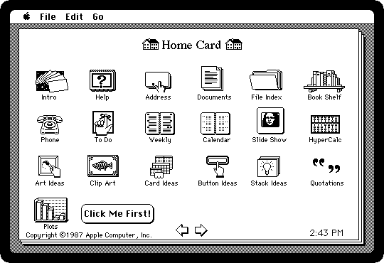
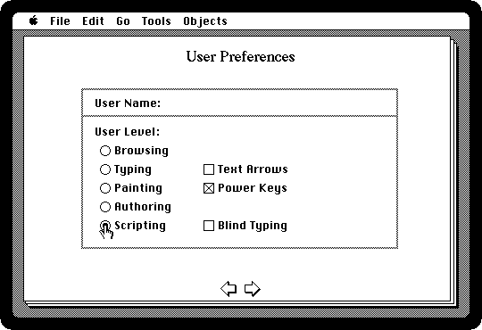
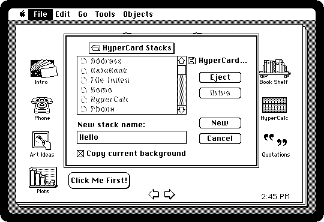
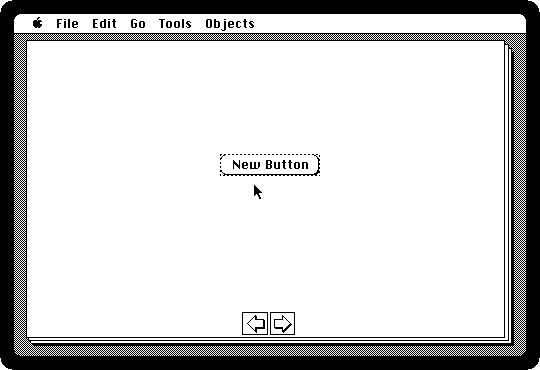
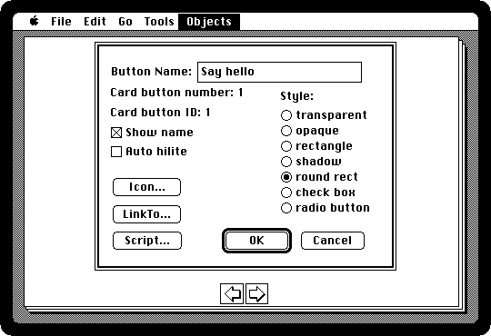
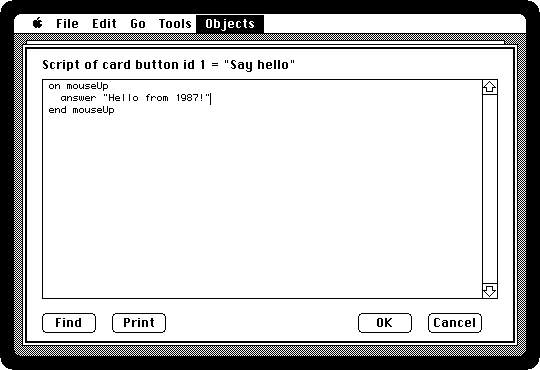
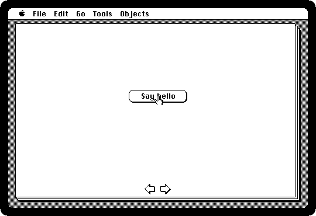

# HyperCard

[Back to the activities](README.md)

In 1987 Apple started putting a new program on every Macintosh it sold:
**HyperCard**, by Bill Atkinson, the author of MacPaint. A HyperCard *stack* is
a pile of cards, each with pictures, text fields and buttons; a click on a
button goes to another card, or another stack, or does whatever its script
says. The scripts are in **HyperTalk**, a language written to read like
English, and anyone could open a stack, look at how it was made, and change
it.

People made address books with it, and teaching material, and games, and the
first versions of Myst were HyperCard stacks. This is HyperCard 1.1, of 1987:
browsing what came with it, and then a stack of your own with a button and a
script.

## What you need

**`hypercard.dsk`**, the HyperCard Startup diskette: from izmac's repository,
open
[test_images/hypercard.dsk](https://github.com/ivanizag/izmac/blob/main/test_images/hypercard.dsk)
and click *Download raw file*. It is the first of the four diskettes of
[HyperCard 1.1](https://archive.org/details/apple-hyper-card-1.1-1987-english-3.5-800-kb)
at the Internet Archive.

## Browse

1. **Start izmac with it**:

   ```bash
   izmac hypercard.dsk
   ```

   The diskette has a System and HyperCard, and no Finder: it starts
   straight into HyperCard, on the **Home card**, the stack of stacks. Each
   icon is a button that goes to a stack. Some of them are on the other
   diskettes of HyperCard, and ask for them.

   

2. **Click Address**, and go through the cards with **Command-3**, or the
   arrows at the bottom of the card. Each card is a person; the icons on the
   left go to the other stacks, the phone, the calendar, back home.

   

   A card is changed by typing in it, and there is no saving: HyperCard
   writes every change to the stack as it is made.

## Become an author

3. **Press Command-H to go home, and Command-4 to its last card**, the user
   preferences. HyperCard hides its tools from those who only browse: **click
   Scripting**, the highest of the five user levels, and the Tools and
   Objects menus appear.

   

4. **Go home again, and choose New Stack from the File menu.** Call it
   *Hello*, and click New. The new stack keeps the background of the card you
   were on, with its arrows.

   

5. **Choose New Button from the Objects menu.** A button appears in the middle
   of the card, selected.

   

6. **Choose Button Info from the Objects menu**, and name it *Say hello*. The
   rest of the dialog is how it looks, and what it does: an icon, a link to
   another card, or a script.

   

## Write a script

7. **Click Script.** HyperCard has started it already: what goes between
   *on mouseUp* and *end mouseUp* is done when the mouse button is let go
   over the button. Type a line there:

   ```
   on mouseUp
     answer "Hello from 1987!"
   end mouseUp
   ```

   

   Click OK.

8. **Press Command-Tab** for the browse tool, the hand that clicks buttons
   rather than editing them, and **click Say hello**.

   

   *answer* puts up a dialog with the words given and an OK button. A
   stack's scripts can go to cards, show and hide things, play sounds, do
   sums and ask questions, and they are all a click away from whoever has the
   stack: choose Button Info on any button of the stacks that came with
   HyperCard to see how it was done.

## What next

[Programming in BASIC](basic.md) is how it was done before HyperCard, and
[ResEdit](resedit.md) is the other tool for looking inside the programs of a
Macintosh.
