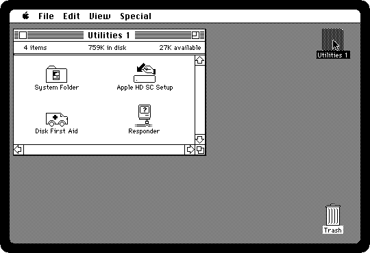
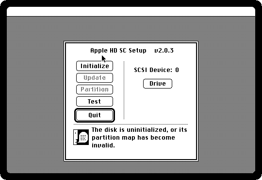
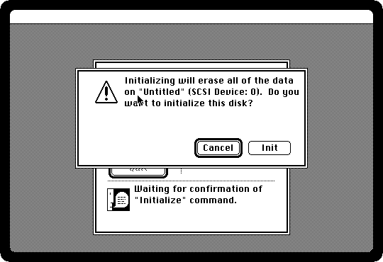
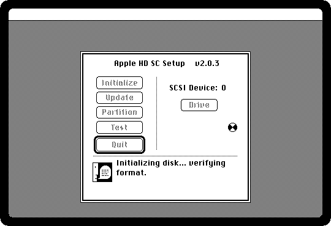
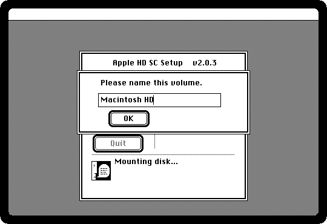
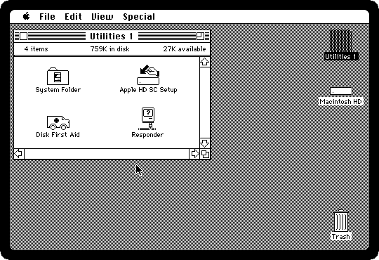
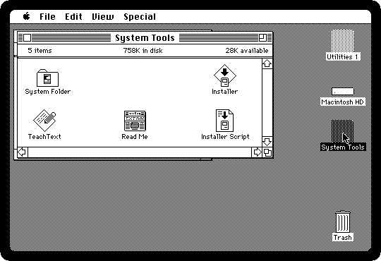
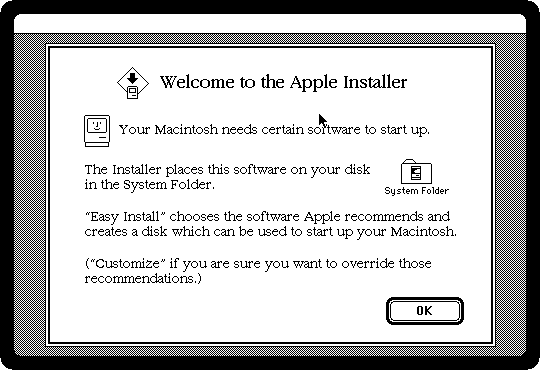
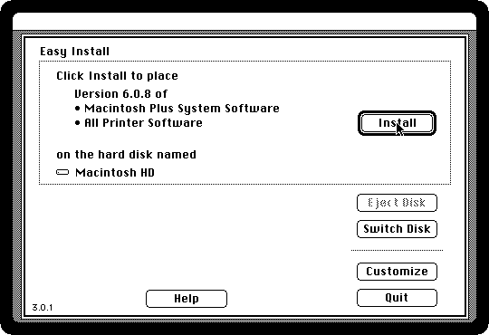
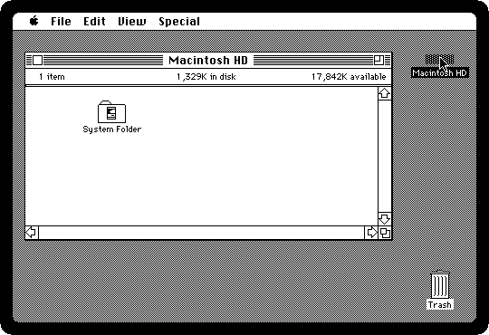

# Installing System 6 on a hard disk

[Back to the activities](README.md)

A hard disk changed what a Macintosh was like to live with: no more
diskettes in and out, programs that opened in seconds, and twenty megabytes,
the size of twenty-five diskettes, in one place. It came empty, and its owner
made it into a startup disk with the diskettes of the System: **Apple HD SC
Setup**, from the Utilities diskette, prepared it, and the **Installer**, from
System Tools, put the System on it.

This is System 6.0.8, of 1991, installed on an empty hard disk from its four
800K diskettes, the way it was done.

## What you need

- **The four diskettes of System 6.0.8**, from izmac's repository: open each
  of these and click *Download raw file*:
  [utilities-1.dsk](https://github.com/ivanizag/izmac/blob/main/test_images/utilities-1.dsk),
  [system-tools.dsk](https://github.com/ivanizag/izmac/blob/main/test_images/system-tools.dsk),
  [utilities-2.dsk](https://github.com/ivanizag/izmac/blob/main/test_images/utilities-2.dsk) and
  [printing-tools.dsk](https://github.com/ivanizag/izmac/blob/main/test_images/printing-tools.dsk).
  They are the set of the [MacPack](https://archive.org/details/macpack) of
  the Internet Archive.
- **An empty hard disk**: a file of 20 megabytes full of zeros. On macOS or
  Linux, in a terminal:

  ```bash
  dd if=/dev/zero of=blank.img bs=1048576 count=20
  ```

  On Windows, in PowerShell:

  ```powershell
  [IO.File]::WriteAllBytes("$PWD\blank.img", (New-Object byte[] 20971520))
  ```

## Prepare the disk

1. **Start izmac from Utilities 1, with the empty disk**:

   ```bash
   izmac utilities-1.dsk blank.img
   ```

   The Macintosh starts from the diskette; the hard disk has nothing on it
   the Finder can show. Open the diskette.

   

2. **Double-click Apple HD SC Setup.** It looks for drives on the SCSI port at
   the back of the Macintosh, and finds this one, *SCSI Device: 0*, with
   nothing on it.

   

3. **Click Initialize**, and **Init** when it warns that everything on the
   disk will be erased.

   

   It formats the disk, puts on it the partition map and the driver the
   Macintosh needs to start from it, and checks it all, which takes a minute
   or two.

   

4. **Name it**, *Macintosh HD*, and OK.

   

5. **Click Quit.** The new disk is on the desktop, empty.

   

## Install the System

6. **Drag `system-tools.dsk` onto the izmac window.** It goes in the second
   drive. Open it.

   

7. **Double-click the Installer**, and click OK.

   

8. **Easy Install** has chosen what this Macintosh needs, the System for a
   Macintosh Plus and the printer software, and the disk to put it on,
   *Macintosh HD*.

   

9. **Click Install.** The Installer copies from one diskette after another,
   and ejects each when it is done with it and asks for the next by name.
   When it asks, drag that diskette onto the window: *Utilities 2*, then
   *Printing Tools*, then *System Tools* again.

   

   The recording is ten times faster than it happens: the real thing takes a
   few minutes, most of it reading diskettes.

10. **Click Quit** when it says the installation was successful.

## Start from the hard disk

11. **Choose Restart from the Special menu.** The Macintosh ejects the
    diskettes, as it always does on a restart, and with no diskette in the
    drive it starts from the hard disk.

    

    That was the end of starting from diskettes. `blank.img` is a Macintosh
    hard disk now, and `izmac blank.img` starts from it.

## What next

[MultiFinder](multifinder.md) is what a hard disk and more memory were
for, and [Life with diskettes](floppies.md) is what it put an end to.
