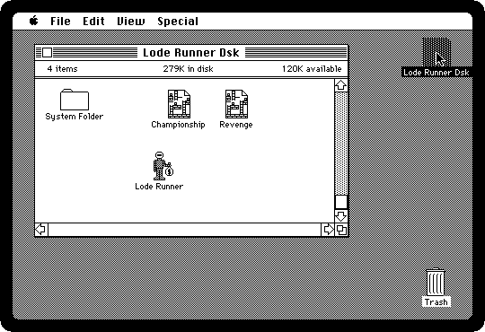
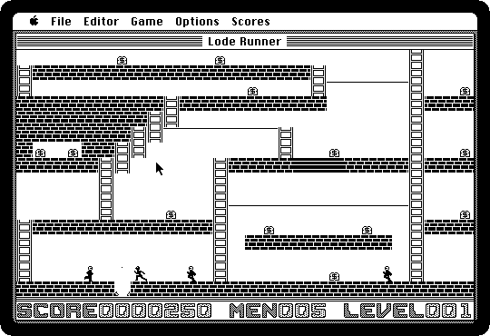

# Lode Runner

[Back to the activities](README.md)

**Lode Runner** was Broderbund's game of 1983, first on the Apple II and then
on almost every home computer, the Macintosh among them: a runner in a
building of bricks and ladders, collecting gold while guards chase him. He
can't jump and has no weapon; what he has is a gun that digs holes in the
bricks, for a guard to fall into, and the holes fill up again a few seconds
later.

It came with an editor to make new levels, which made it one of the first
games whose players made games of it.

## What you need

**`loderunner.dsk`**, from izmac's repository: open
[test_images/loderunner.dsk](https://github.com/ivanizag/izmac/blob/main/test_images/loderunner.dsk)
and click *Download raw file*. It is the
[Lode Runner diskette](https://archive.org/details/mac_Lode_Runner) of the
Internet Archive.

## Play

1. **Start izmac with the diskette**, and open it:

   ```bash
   izmac loderunner.dsk
   ```

   Besides the game there are two sets of levels: *Championship*, made
   harder, and *Revenge*.

   

2. **Double-click Lode Runner.** Until a key is pressed, it plays its first
   level by itself: the runner going up the ladders and along the bars for
   the gold, and the guards after him.

   

3. **Choose Start Game from the Game menu**, or press Command-S. The runner is
   yours: the keys move him, and dig to the left and to the right of him,
   and the *Options* menu has the game's settings.

   

   All the gold collected opens a ladder at the top of the screen, which goes
   to the next level. *Start Game From* begins at another level, and the
   *Editor* menu is for making levels of your own.

## What next

[Dark Castle](dark-castle.md) is the other side of the games of the Plus,
drawn like an old engraving, and [Software from the archives](archives.md)
has Bolo, the tank game of the AppleTalk networks.
