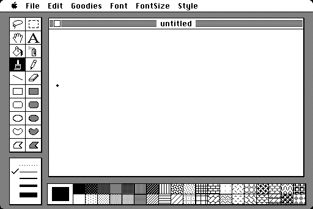
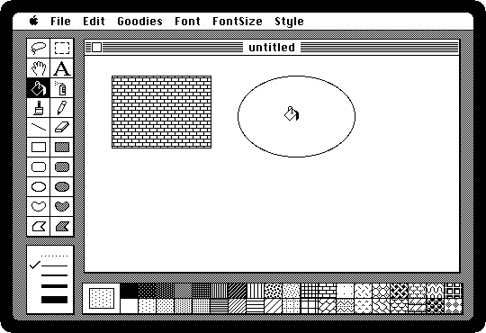
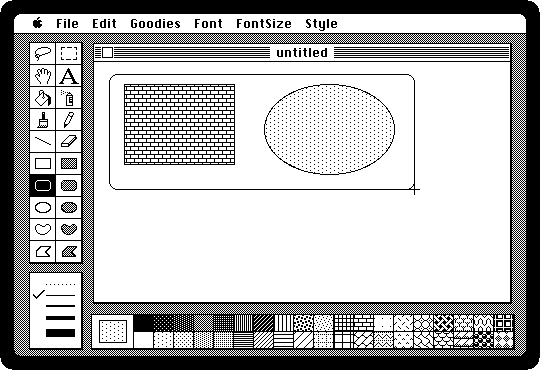
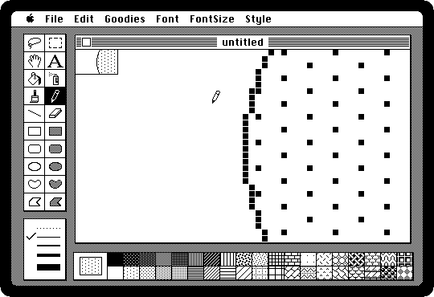
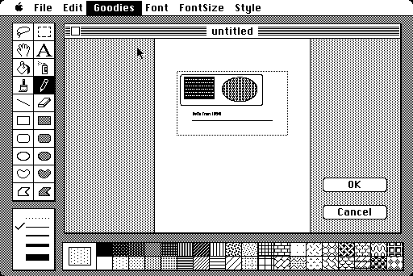
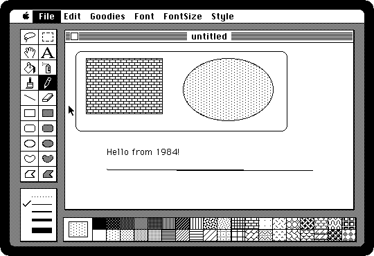
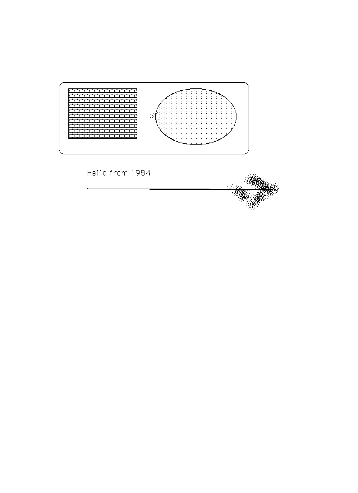

# Drawing in MacPaint

[Back to the activities](README.md)

MacPaint came with every Macintosh in 1984, and it was what people were shown
when they were shown a Macintosh: a picture drawn with the mouse, in patterns,
seen on the screen exactly as it would print. Bill Atkinson wrote it, on top of
QuickDraw, the graphics of the Macintosh, which he had written too.

This is a drawing made from start to finish: shapes, patterns, text, the
drawing looked at a dot at a time, and printed on the ImageWriter, the dot
matrix printer most Macintosh owners had beside it.

## What you need

Only izmac. MacPaint 1.5 is on the diskette it starts with when you give it
nothing, the [MacPaint diskette](https://archive.org/details/mac_Paint_2) of the
Internet Archive, and izmac puts an ImageWriter on the printer port, whose
pages it writes as images.

## Open MacPaint

1. Run `izmac`, double-click the *Paint* diskette, and double-click **MacPaint**.
   [The 1984 experience](first-steps.md) shows the way there.

   MacPaint opens on an empty page. The tools are on the left, the line
   widths under them, and the patterns along the bottom; the square at the
   bottom left is the pattern chosen now.

   

   The tools, two columns of them, from the top: the lasso and the selection
   rectangle, the hand that moves the page and the text, the paint bucket and
   the spray can, the brush and the pencil, the line and the eraser, and then
   the shapes, each empty on the left and filled with the pattern on the right:
   rectangles, rounded rectangles, ovals, free shapes and polygons.

## Draw

2. **Click a pattern at the bottom**, the bricks for instance, and **the filled
   rectangle** in the tools, the right one of the sixth row. Then drag on the
   page from one corner of the rectangle to the other.

3. **Click the empty oval**, the left one of the eighth row, and drag an oval
   beside the rectangle. Then **click the grey pattern and the paint bucket**,
   the left one of the third row, and click inside the oval: the pattern pours
   into it, up to the black dots of its edge, all at once.

   

   Then **the empty rounded rectangle**, on the left of the seventh row, and
   drag one around both.

   

   Every shape is drawn into the picture as dots, and stays dots: MacPaint has
   no shapes to move afterwards, only a page of black and white dots, the way
   the screen is. *Undo* in the Edit menu takes back the last thing done.

4. **Click the A**, the text tool, click under the shapes and type. The Font,
   FontSize and Style menus change how it looks while you are typing it.

5. **Click the pencil** and drag a line under the text.

   

## FatBits

6. **Hold the Command key and click with the pencil** on the edge of the oval.
   That is **FatBits**: the place you clicked, magnified, each dot of the
   picture a square that the pencil turns black or white with a click. The
   small window at the top left shows it at its real size. Choose *FatBits*
   from the Goodies menu to go back.

   

   Every icon of those years was drawn like this, a dot at a time.

7. **Choose Show Page from the Goodies menu.** The page, all of it at once,
   with the part in the window outlined: a MacPaint picture is a page of 576
   by 720 dots, eight by ten inches at 72 dots to the inch, and the window only
   ever shows a piece of it. Drag the outline to look at another piece, or
   click **OK**.

   

## Print

8. **Choose Print Final from the File menu.** *Print Draft* is quicker and
   rougher. MacPaint draws the page, a band at a time, as it sends it to the
   printer, and it takes a while: izmac sends it to its ImageWriter at the
   speed of the serial port of the Macintosh, as the real one did. The
   recording is five times faster than that; the real thing takes about forty
   seconds.

   

9. The page comes out beside izmac, as a picture: izmac says

   ```
   The printer has finished a page: izmac_page_001.png
   ```

   and the file is the page as the ImageWriter would have printed it, at 144
   dots to the inch.

   

   The printed drawing is a bit narrower than on the screen, the way every
   Macintosh printed on an ImageWriter: the screen has 72 dots to the inch and
   the printer put them down at 80. [Printing](../printing.md) has the rest of
   what izmac's ImageWriter does.

## Keep it

10. **Choose Save As from the File menu**, give the picture a name and click
    *Save*. It goes on the diskette, which only has room for a few, and izmac
    keeps the diskette the next time it starts.
