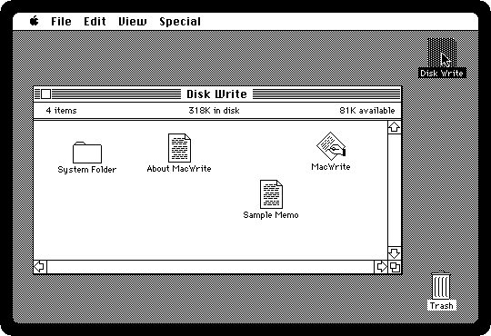
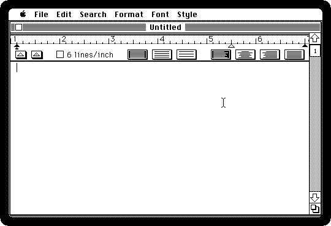
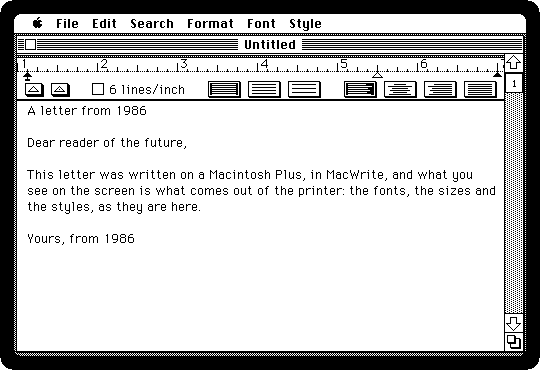
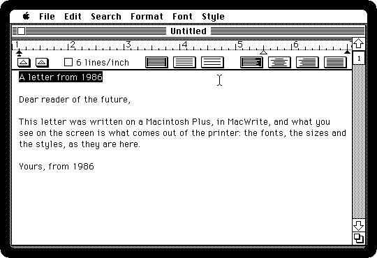
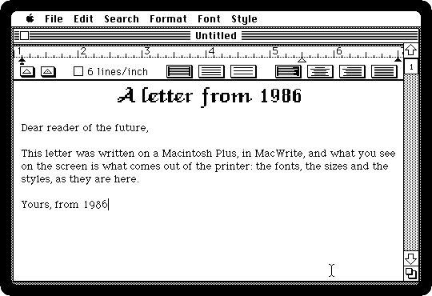
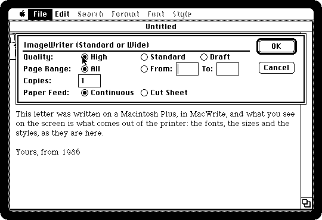
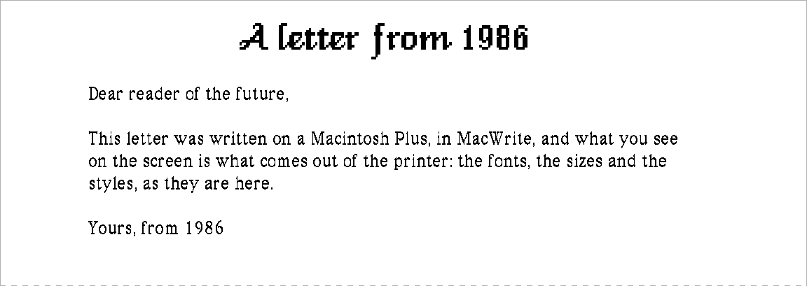
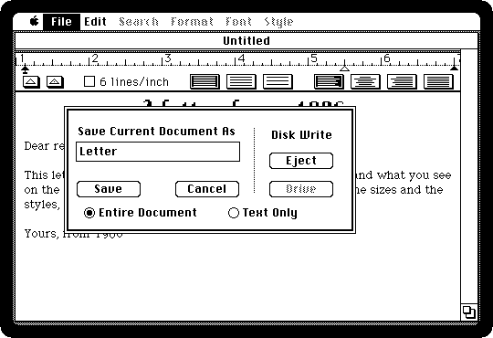

# Writing a letter in MacWrite

[Back to the activities](README.md)

MacWrite came with the first Macintosh, beside MacPaint, and showed what no
word processor of 1984 did: the text on the screen as it would be on paper,
in the fonts and sizes and styles it would be printed in, with the margins and
the tabs on a ruler above it. *What you see is what you get* was the phrase,
and the ImageWriter beside the Macintosh printed what was on the screen.

This is a letter written, styled and printed in MacWrite 4.5, of 1985, the
MacWrite of the years of the Macintosh Plus.

## What you need

**`macwrite.dsk`**, the MacWrite diskette, with its own System: from izmac's
repository, open
[test_images/macwrite.dsk](https://github.com/ivanizag/izmac/blob/main/test_images/macwrite.dsk)
and click *Download raw file*. It is the
[MacWrite 4.5 diskette](https://archive.org/details/mac_Disk_Write_2) of the
Internet Archive.

## Write

1. **Start izmac with the diskette**, and open it:

   ```bash
   izmac macwrite.dsk
   ```

   On it are MacWrite, a guide to it, *About MacWrite*, and a *Sample Memo*,
   both MacWrite documents.

   

2. **Double-click MacWrite.** It opens a new document, *Untitled*, with the
   ruler at the top: the margins and the indent are the triangles on it, the
   tabs are added from the two boxes below it, and the boxes on the right are
   the line spacing and the alignment.

   

3. **Type the letter.** A title on the first line, an empty line, and then
   the text; Return only at the end of a paragraph, since MacWrite wraps the
   lines itself.

   

## Style

4. **Select the title**, by dragging across it, and **choose a font from the
   Font menu**. These are the fonts of the System, drawn by Susan Kare and
   named after cities: Athens, Chicago, Geneva, London, Monaco, New York and
   Venice. Then **24 Point from the Style menu**, and **Align Center
   from the Format menu**.

   

   The title is in Venice here. Each font came in a few sizes drawn dot by
   dot, the ones in outline in the Style menu; any other size was scaled from
   them, and looked it.

5. **Select the rest of the letter and choose New York**, the font for text.

   

## Print and keep

6. **Choose Print from the File menu.** The ImageWriter offers three
   qualities: *Draft* is the fastest, in the printer's own letters with no
   styles; *Standard* is the screen, dot for dot; and **High**, the one to
   choose, prints each letter from a font of twice the size, twice as fine
   as the screen, and takes longer. Click OK.

   

7. The page comes out as an image beside izmac, `izmac_page_001.png`, a whole
   page of eleven inches. This is its top, where the letter is:

   

   [Printing](../printing.md) has what izmac's ImageWriter does with the
   pages.

8. **Choose Save As from the File menu**, call it *Letter*, and click Save.
   It goes on the diskette, beside MacWrite.

   

## What next

[Drawing in MacPaint](macpaint.md) is the other half of the first Macintosh,
and [Desk accessories and the Clipboard](desk-accessories.md) is how text and
pictures went from one program to another.
