# Exploring the Mandelbrot set with MPW

[Back to the activities](README.md)

**MPW**, the Macintosh Programmer's Workshop, was Apple's own way of making
Macintosh software, sold to developers through APDA, Apple's programmers'
association. It looked nothing like the rest of the Macintosh: its windows are
text, and in any of them a line typed and sent with the Enter key is a command,
run there and then, with its answer written below it. The commands are the
compilers for C, Pascal and assembly language, the linker, and tools for
everything else, and they can be put together into scripts. Apple made its
own software with it.

The **Mandelbrot set** came into fashion in the same years, after *Scientific
American* showed its readers how to draw it, in August 1985. A point of the
plane belongs to it if a simple sum, repeated, never runs away to infinity;
coloured by how quickly it does run away, the edge of the set is a coastline
that never ends, with smaller copies of the whole along it. Every owner of a
computer who could program drew it, and waited for it.

This page writes a Mandelbrot set explorer in C with MPW 3.1, of 1989: it
draws the set, and a rectangle dragged over it is drawn again, closer.

## What you need

- **`system6.dsk`**, System 6 on a diskette with the AppleShare part of the
  Chooser on it, from izmac's repository: open
  [test_images/system6.dsk](https://github.com/ivanizag/izmac/blob/main/test_images/system6.dsk)
  and click *Download raw file*.
- **A hard disk.** MPW needs one, and two megabytes of memory. The one made
  in [Installing System 6 on a hard disk](installing.md), `blank.img`, is the
  one used here. Only its space is needed: the Macintosh starts from
  `system6.dsk`, because the System installed on the hard disk has no
  AppleShare to reach the file server with.
- **MPW**, on the CD Apple sent its developers in 1989:
  `mpw3-cdrom.zip`, *MPW 3.0/3.1 CD for System 6*, from the
  [Macintosh Repository](https://www.macintoshrepository.org/545-macintosh-programmer-s-workshop-mpw-3-x),
  or from izmac's repository,
  [test_images/mpw3-cdrom.zip](https://github.com/ivanizag/izmac/blob/main/test_images/mpw3-cdrom.zip).
  There is no need to unpack it: izmac takes the zip as it is.
- **A folder to share**, called *For the Mac*, where the program will be
  written, with any text editor of your computer.

## Install MPW

1. **Start izmac** with four megabytes, the System diskette, the hard disk,
   the CD and the folder:

   ```bash
   izmac -ram 4096 -share "For the Mac" system6.dsk blank.img mpw3-cdrom.zip
   ```

   izmac takes the image of the CD out of the zip and puts it on the SCSI
   bus, as a CD-ROM drive would be. The CD is locked, as a CD is: nothing can
   be written to it.

   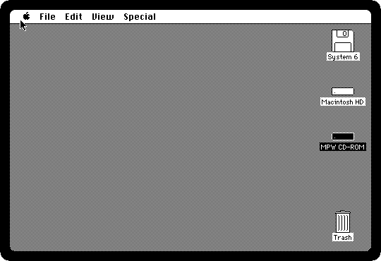

2. **Open MPW CD-ROM.** Two versions of MPW, 3.0 and 3.1, MacsBug, the
   debugger that takes over the whole machine, SADE, the one that works in a
   window, and ResEdit.

   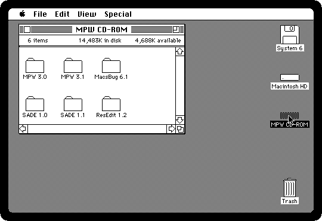

3. **Drag MPW 3.1 onto the icon of Macintosh HD.** The Finder copies it, file
   by file: about three minutes on a Macintosh Plus.

   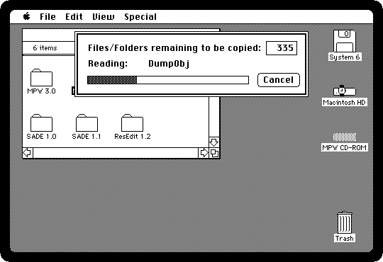

## The program

4. **Put the program in a file, `Mandelbrot.c`, in the folder *For the
   Mac*.** It is in izmac's repository,
   [doc/activities/listings/Mandelbrot.c](listings/Mandelbrot.c): open it and
   click *Download raw file*. The blocks of C of this section are the same
   program, one after the other, with what each part does.

The program begins with the Toolbox's headers, which MPW has in its
*Interfaces* folder, and the numbers it goes by. Every window shows a part of
the plane of its own, and keeps it in a `View`: its picture, kept in a bitmap
the size of the window, the point of the plane at its top left, how far apart
its pixels are, and the next row to draw. The window carries it in its
`refCon`, a field the Window Manager keeps for the program.

```c
#include <Types.h>
#include <Memory.h>
#include <Quickdraw.h>
#include <Fonts.h>
#include <Events.h>
#include <OSEvents.h>
#include <Menus.h>
#include <Windows.h>
#include <TextEdit.h>
#include <Dialogs.h>
#include <Desk.h>
#include <OSUtils.h>
#include <ToolUtils.h>
#include <Packages.h>

#define MaxIterations 64
#define Four (4L << 16)
#define StatusHeight 16
#define StartWidth 288
#define StartHeight 192

#define AppleID 128
#define FileID 129
#define EditID 130
#define ViewID 131

/* What a window shows: its picture, the point of the plane at its top left,
   how far apart its pixels are, and the next row to draw */
typedef struct {
    BitMap image;
    Fixed left, top, step;
    short row;
} View, *ViewPtr;

MenuHandle appleMenu, editMenu, viewMenu;
short windows;
Boolean quitting, editEnabled, blackAndWhite;
Point lastMouse;
```

The heart of it is how many times the sum goes round for a point before it
runs away: *z* starts at the point *c*, and becomes *z*² + *c*, until it is
further than 2 from 0, or 64 times have gone by and the point is taken as part
of the set. The Plus has no hardware for numbers with decimals, and doing them
in software, with SANE, the Macintosh's maths package, would take hours for a
picture. So the numbers are the Toolbox's `Fixed`, 16 bits for the whole part
and 16 for the fraction, which add as whole numbers do, and multiply with
`FixMul`, in the ROM. The points inside the big heart shape of the set and
the circle to its left would go round all 64 times for nothing: two sums tell
them apart first.

```c
short Iterations(Fixed cr, Fixed ci)
{
    Fixed zr = cr, zi = ci, zr2, zi2, x, q;
    short n;

    /* Inside the main cardioid or the bulb to its left */
    x = cr - (1L << 14);
    zi2 = FixMul(ci, ci);
    q = FixMul(x, x) + zi2;
    if (FixMul(q, q + x) < zi2 >> 2)
        return MaxIterations;
    x = cr + (1L << 16);
    if (FixMul(x, x) + zi2 < 1L << 12)
        return MaxIterations;

    for (n = 0; n < MaxIterations; n++) {
        zr2 = FixMul(zr, zr);
        zi2 = FixMul(zi, zi);
        if (zr2 + zi2 > Four)
            return n;
        zi = (FixMul(zr, zi) << 1) + ci;
        zr = zr2 - zi2 + cr;
    }
    return MaxIterations;
}
```

A row of a picture is worked out a pixel at a time, into its bitmap, and
copied onto the window with `CopyBits`. The points of the set are black. The
others are dithered: the number of times the sum went round, from 0 to 15, is
how many dots of 16 are black around it, so that the grays draw the bands
around the set, the lightest furthest away. A screen of only black and white
had to do grays this way. In *Black and White* they are all white. Of all the
windows, the frontmost with rows left to draw gets the next one. A window
made bigger or smaller gets a new bitmap, and starts again, with the same
point of the plane in its middle.

```c
/* The 4 by 4 dither: how many of 16 a pixel needs to be black */
short dither[4][4] = {
    {0, 8, 2, 10}, {12, 4, 14, 6}, {3, 11, 1, 9}, {15, 7, 13, 5}
};

void DrawRow(WindowPtr window, ViewPtr view)
{
    short width = view->image.bounds.right;
    Ptr bits = view->image.baseAddr + (long) view->row * view->image.rowBytes;
    Fixed ci = view->top - view->step * view->row;
    Rect line;
    short col, n;
    Boolean black;

    for (col = 0; col < view->image.rowBytes; col++)
        bits[col] = 0;
    for (col = 0; col < width; col++) {
        n = Iterations(view->left + view->step * col, ci);
        if (blackAndWhite)
            black = n == MaxIterations;
        else
            black = n == MaxIterations || (n & 15) > dither[view->row & 3][col & 3];
        if (black)
            bits[col >> 3] |= 0x80 >> (col & 7);
    }
    SetRect(&line, 0, view->row, width, view->row + 1);
    SetPort(window);
    CopyBits(&view->image, &window->portBits, &line, &line, srcCopy, nil);
    view->row++;
}

/* Draws the next row of the frontmost window that has rows left to draw */
void DrawSomething(void)
{
    WindowPeek window;
    ViewPtr view;

    for (window = (WindowPeek) FrontWindow(); window != nil; window = window->nextWindow) {
        view = window->windowKind == userKind ? (ViewPtr) window->refCon : nil;
        if (view != nil && view->row < view->image.bounds.bottom) {
            DrawRow((WindowPtr) window, view);
            return;
        }
    }
}

/* The picture made the size of the window, but for the status line, with
   the same point of the plane in its middle, and started again */
void Resize(WindowPtr window, ViewPtr view)
{
    short width = window->portRect.right - window->portRect.left;
    short height = window->portRect.bottom - window->portRect.top - StatusHeight;
    long size;

    view->left -= view->step * ((width - view->image.bounds.right) / 2);
    view->top += view->step * ((height - view->image.bounds.bottom) / 2);

    if (view->image.baseAddr != nil)
        DisposPtr(view->image.baseAddr);
    view->image.rowBytes = (width + 15) / 16 * 2;
    SetRect(&view->image.bounds, 0, 0, width, height);
    size = (long) view->image.rowBytes * height;
    view->image.baseAddr = NewPtr(size);
    while (size > 0)
        view->image.baseAddr[--size] = 0;
    view->row = 0;
}
```

The line at the bottom of each window says where the pointer is on the plane,
and what that point does: in the set, or out after how many times round.
There is no `printf` here: the line is a Pascal string, a length and its
characters, as the Toolbox takes them, built a piece at a time, with the
numbers turned into digits by `NumToString` and a `Fixed` into decimals by
hand. The grow box, in the corner, is drawn by `DrawGrowIcon`, which would
draw the edges of scroll bars too, so it is clipped to the box.

```c
/* The status line: where the pointer is on the plane, and what that point
   does */
void AppendText(Str255 s, char *text)
{
    while (*text)
        s[++s[0]] = *text++;
}

void AppendDigits(Str255 s, long number, short first)
{
    Str255 digits;
    short i;

    NumToString(number, digits);
    for (i = first; i <= digits[0]; i++)
        s[++s[0]] = digits[i];
}

/* A Fixed in decimal, to five places */
void AppendFixed(Str255 s, Fixed f)
{
    long fraction;

    if (f < 0) {
        AppendText(s, "-");
        f = -f;
    }
    fraction = ((f & 0xFFFFL) * 15625 + 5120) / 10240;
    if (fraction >= 100000) {
        f += 1L << 16;
        fraction -= 100000;
    }
    AppendDigits(s, f >> 16, 1);
    AppendText(s, ".");
    AppendDigits(s, fraction + 100000, 2);
}

void DrawStatus(WindowPtr window, ViewPtr view, Str255 text)
{
    Rect strip = window->portRect;

    SetPort(window);
    strip.top = view->image.bounds.bottom;
    strip.right -= 15;
    EraseRect(&strip);
    MoveTo(strip.left, strip.top);
    LineTo(strip.right, strip.top);
    MoveTo(strip.left + 4, strip.bottom - 4);
    TextFont(geneva);
    TextSize(9);
    DrawString(text);
}

void TrackMouse(void)
{
    WindowPtr window = FrontWindow();
    ViewPtr view;
    Point where;
    Fixed cr, ci;
    short n;
    Str255 text;

    if (window == nil || ((WindowPeek) window)->windowKind != userKind)
        return;
    view = (ViewPtr) GetWRefCon(window);
    SetPort(window);
    GetMouse(&where);
    if (where.h == lastMouse.h && where.v == lastMouse.v)
        return;
    lastMouse = where;
    text[0] = 0;
    if (PtInRect(where, &view->image.bounds)) {
        cr = view->left + view->step * where.h;
        ci = view->top - view->step * where.v;
        n = Iterations(cr, ci);
        AppendFixed(text, cr);
        AppendText(text, "  ");
        AppendFixed(text, ci);
        if (n == MaxIterations)
            AppendText(text, "  in the set");
        else {
            AppendText(text, "  out after ");
            AppendDigits(text, n, 1);
        }
    }
    DrawStatus(window, view, text);
}

/* The grow box, without the lines of the scroll bars there are none of */
void DrawGrowBox(WindowPtr window)
{
    Rect box = window->portRect;
    RgnHandle clip = NewRgn();

    SetPort(window);
    GetClip(clip);
    box.left = box.right - 15;
    box.top = box.bottom - 15;
    ClipRect(&box);
    DrawGrowIcon(window);
    SetClip(clip);
    DisposeRgn(clip);
}
```

The windows: a new one for the whole set, 3.5 wide from -2.5, and a new one
for the rectangle dragged, a little lower and to the right of the one it was
dragged in. The rectangle is drawn with the pen in `patXor` mode, which draws
by inverting: drawn again in the same place, it is gone, and what was under it
is back. It keeps the shape of the picture, whichever way it is dragged. A
`Fixed` has no more than 16 bits of fraction, so a zoom that would put the
pixels closer than 4 of 65536 apart beeps instead.

```c
/* A window of its own for a view of the plane, at a place on the screen */
void NewView(Rect *box, Fixed left, Fixed top, Fixed step)
{
    WindowPtr window;
    ViewPtr view;
    Str255 title;

    windows++;
    title[0] = 0;
    AppendText(title, "Mandelbrot ");
    AppendDigits(title, windows, 1);
    window = NewWindow(nil, box, title, true, documentProc, (WindowPtr) -1, true, 0);
    view = (ViewPtr) NewPtr(sizeof(View));
    view->image.baseAddr = nil;
    SetRect(&view->image.bounds, 0, 0, box->right - box->left,
        box->bottom - box->top - StatusHeight);
    view->left = left;
    view->top = top;
    view->step = step;
    SetWRefCon(window, (long) view);
    Resize(window, view);
}

/* The whole set: 3.5 wide, from -2.5, in the window the program starts
   with */
#define StartStep ((7L << 15) / StartWidth)

void WholeSet(ViewPtr view)
{
    view->step = StartStep;
    view->left = -(5L << 15);
    view->top = view->step * (view->image.bounds.bottom / 2);
    view->row = 0;
}

void NewWholeSet(void)
{
    Rect box;
    ViewPtr view;

    SetRect(&box, 0, 0, StartWidth, StartHeight + StatusHeight);
    OffsetRect(&box, (512 - StartWidth) / 2 + windows % 8 * 16, 50 + windows % 8 * 16);
    NewView(&box, 0, 0, 0);
    view = (ViewPtr) GetWRefCon(FrontWindow());
    WholeSet(view);
}

void ZoomOut(ViewPtr view)
{
    if (view->step > StartStep * 4) {
        SysBeep(1);
        return;
    }
    view->left -= view->step * (view->image.bounds.right / 2);
    view->top += view->step * (view->image.bounds.bottom / 2);
    view->step <<= 1;
    view->row = 0;
}

/* The rectangle from a corner towards a point, of the shape of the picture */
void Selection(ViewPtr view, Point from, Point to, Rect *frame)
{
    short width = view->image.bounds.right, height = view->image.bounds.bottom;
    short wide = to.h - from.h, tall = to.v - from.v;
    short size = wide < 0 ? -wide : wide;

    if ((long) (tall < 0 ? -tall : tall) * width / height > size)
        size = (long) (tall < 0 ? -tall : tall) * width / height;
    SetRect(frame, from.h, from.v, from.h + size,
        from.v + (short) ((long) size * height / width));
    if (wide < 0)
        OffsetRect(frame, -size, 0);
    if (tall < 0)
        OffsetRect(frame, 0, -(frame->bottom - frame->top));
}

/* A rectangle dragged in the picture, and a new window with what is in it */
void ZoomIn(WindowPtr window, ViewPtr view, Point from)
{
    Point to, now;
    Rect frame, box;
    short size;

    SetPort(window);
    GlobalToLocal(&from);
    PenMode(patXor);
    to = from;
    Selection(view, from, to, &frame);
    FrameRect(&frame);
    while (StillDown()) {
        GetMouse(&now);
        if (now.h != to.h || now.v != to.v) {
            FrameRect(&frame);
            to = now;
            Selection(view, from, to, &frame);
            FrameRect(&frame);
        }
    }
    FrameRect(&frame);
    PenNormal();

    size = frame.right - frame.left;
    if (size < 4)
        return;
    if (view->step * size / view->image.bounds.right < 4) {
        SysBeep(1);
        return;
    }
    box = window->portRect;
    LocalToGlobal((Point *) &box.top);
    LocalToGlobal((Point *) &box.bottom);
    OffsetRect(&box, 16, 16);
    if (box.bottom > qd.screenBits.bounds.bottom - 4)
        OffsetRect(&box, 0, qd.screenBits.bounds.bottom - 4 - box.bottom);
    if (box.right > qd.screenBits.bounds.right - 4)
        OffsetRect(&box, qd.screenBits.bounds.right - 4 - box.right, 0);
    NewView(&box, view->left + view->step * frame.left,
        view->top - view->step * frame.top,
        view->step * size / view->image.bounds.right);
}

void CloseView(WindowPtr window)
{
    ViewPtr view = (ViewPtr) GetWRefCon(window);

    DisposPtr(view->image.baseAddr);
    DisposPtr((Ptr) view);
    DisposeWindow(window);
}
```

The rest is what every Macintosh program had to do for itself. The menus are
handled here: the Apple menu with *About Mandelbrot* and the desk
accessories, the File menu, the Edit menu for the desk accessories, which is
dimmed while a window of the program is in front, and the View menu. A click
is taken where it fell: on the menu bar, on a title bar to drag the window, on
a grow box to make it bigger or smaller, on a close box, or in a picture to
zoom. A window that has to be drawn again, uncovered or made bigger, gets an
*update* event, and the rows done so far are copied back from its bitmap.

```c
void ShowAbout(void)
{
    Rect box;
    WindowPtr about;

    HiliteMenu(0);
    SetRect(&box, 96, 110, 416, 190);
    about = NewWindow(nil, &box, "\p", true, dBoxProc, (WindowPtr) -1, false, 0);
    SetPort(about);
    MoveTo(20, 30);
    DrawString("\pMandelbrot, written in MPW C.");
    MoveTo(20, 55);
    DrawString("\pDrag a rectangle in it to zoom in.");
    while (!Button())
        SystemTask();
    while (Button())
        ;
    FlushEvents(everyEvent, 0);
    DisposeWindow(about);
}

/* Every window started again, after a change of how it is drawn */
void RedrawAll(void)
{
    WindowPeek window;

    for (window = (WindowPeek) FrontWindow(); window != nil; window = window->nextWindow)
        if (window->windowKind == userKind)
            ((ViewPtr) window->refCon)->row = 0;
}

void DoMenu(long choice)
{
    short item = LoWord(choice);
    WindowPtr front = FrontWindow();
    ViewPtr view = nil;
    Str255 name;

    if (front != nil && ((WindowPeek) front)->windowKind == userKind)
        view = (ViewPtr) GetWRefCon(front);
    switch (HiWord(choice)) {
    case AppleID:
        if (item == 1)
            ShowAbout();
        else {
            GetItem(appleMenu, item, name);
            OpenDeskAcc(name);
        }
        break;
    case FileID:
        if (item == 1)
            NewWholeSet();
        else if (item == 2 && front != nil) {
            if (((WindowPeek) front)->windowKind < 0)
                CloseDeskAcc(((WindowPeek) front)->windowKind);
            else if (view != nil)
                CloseView(front);
        } else if (item == 4)
            quitting = true;
        break;
    case EditID:
        SystemEdit(item - 1);
        break;
    case ViewID:
        if (item == 1 && view != nil)
            ZoomOut(view);
        else if (item == 2 && view != nil)
            WholeSet(view);
        else if (item == 4) {
            blackAndWhite = !blackAndWhite;
            CheckItem(viewMenu, 4, blackAndWhite);
            RedrawAll();
        }
        break;
    }
    HiliteMenu(0);
}

void DoMouseDown(EventRecord *event)
{
    WindowPtr which;
    Rect limits;
    long size;

    switch (FindWindow(event->where, &which)) {
    case inMenuBar:
        DoMenu(MenuSelect(event->where));
        break;
    case inSysWindow:
        SystemClick(event, which);
        break;
    case inDrag:
        limits = qd.screenBits.bounds;
        InsetRect(&limits, 4, 4);
        DragWindow(which, event->where, &limits);
        break;
    case inGrow:
        SetRect(&limits, 128, 64 + StatusHeight, qd.screenBits.bounds.right,
            qd.screenBits.bounds.bottom);
        size = GrowWindow(which, event->where, &limits);
        if (size != 0) {
            SizeWindow(which, LoWord(size), HiWord(size), true);
            Resize(which, (ViewPtr) GetWRefCon(which));
            SetPort(which);
            InvalRect(&which->portRect);
        }
        break;
    case inGoAway:
        if (TrackGoAway(which, event->where))
            CloseView(which);
        break;
    case inContent:
        if (which != FrontWindow())
            SelectWindow(which);
        else
            ZoomIn(which, (ViewPtr) GetWRefCon(which), event->where);
        break;
    }
}

void UpdateEditMenu(void)
{
    WindowPeek front = (WindowPeek) FrontWindow();
    Boolean forAccessory = front != nil && front->windowKind < 0;

    if (forAccessory != editEnabled) {
        editEnabled = forAccessory;
        if (editEnabled)
            EnableItem(editMenu, 0);
        else
            DisableItem(editMenu, 0);
        DrawMenuBar();
    }
}

void Update(WindowPtr window)
{
    ViewPtr view = (ViewPtr) GetWRefCon(window);
    Rect drawn;

    BeginUpdate(window);
    SetPort(window);
    EraseRect(&window->portRect);
    drawn = view->image.bounds;
    if (view->row < drawn.bottom)
        drawn.bottom = view->row;
    CopyBits(&view->image, &window->portBits, &drawn, &drawn, srcCopy, nil);
    DrawStatus(window, view, "\p");
    DrawGrowBox(window);
    EndUpdate(window);
    lastMouse.h = -1;
}
```

And the start: the managers of the Toolbox started one by one, the menus made
in the program rather than in a resource file, and the first window. Then the
*event loop*: when nothing has happened, it brings the status line up to date
and draws the next row, so that the pictures build up a row at a time while
the menus and the mouse still work.

```c
void Setup(void)
{
    MenuHandle menu;

    InitGraf(&qd.thePort);
    InitFonts();
    InitWindows();
    InitMenus();
    TEInit();
    InitDialogs(nil);
    InitCursor();
    FlushEvents(everyEvent, 0);

    appleMenu = NewMenu(AppleID, "\p\024");
    AppendMenu(appleMenu, "\pAbout Mandelbrot...;(-");
    AddResMenu(appleMenu, 'DRVR');
    InsertMenu(appleMenu, 0);
    menu = NewMenu(FileID, "\pFile");
    AppendMenu(menu, "\pNew/N;Close/W;(-;Quit/Q");
    InsertMenu(menu, 0);
    editMenu = NewMenu(EditID, "\pEdit");
    AppendMenu(editMenu, "\pUndo/Z;(-;Cut/X;Copy/C;Paste/V;Clear");
    InsertMenu(editMenu, 0);
    DisableItem(editMenu, 0);
    viewMenu = NewMenu(ViewID, "\pView");
    AppendMenu(viewMenu, "\pZoom Out/-;Whole Set/R;(-;Black and White/B");
    InsertMenu(viewMenu, 0);
    DrawMenuBar();

    NewWholeSet();
}

main()
{
    EventRecord event;

    Setup();
    while (!quitting) {
        SystemTask();
        UpdateEditMenu();
        if (GetNextEvent(everyEvent, &event)) {
            switch (event.what) {
            case mouseDown:
                DoMouseDown(&event);
                break;
            case keyDown:
            case autoKey:
                if (event.modifiers & cmdKey)
                    DoMenu(MenuKey(event.message & charCodeMask));
                break;
            case updateEvt:
                Update((WindowPtr) event.message);
                break;
            case activateEvt:
                if (((WindowPeek) event.message)->windowKind == userKind)
                    DrawGrowBox((WindowPtr) event.message);
                lastMouse.h = -1;
                break;
            }
        } else {
            TrackMouse();
            DrawSomething();
        }
    }
}
```

5. **Change the ends of the lines** of the file to the ones of the Macintosh.
   Computers of today end a line with a *line feed*, and the Macintosh with a
   *carriage return*. MPW's C takes a file with line feeds as one long line,
   and compiles nothing out of it, without a word. On macOS or Linux, in a
   terminal on the folder *For the Mac*:

   ```bash
   perl -pi -e 's/\r?\n/\r/g' Mandelbrot.c
   ```

   On Windows, in PowerShell:

   ```powershell
   (Get-Content Mandelbrot.c -Raw) -replace "\r?\n", "`r" | Set-Content -NoNewline Mandelbrot.c
   ```

## Build it

6. **Mount the folder**: choose *Chooser* from the Apple menu, click
   *AppleShare*, then your computer, then *OK*, and log in as a *Guest*.
   Choose *For the Mac*, click *OK* and close the Chooser.
   [Your computer as a file server](file-server.md) tells this step by step.

7. **Open Macintosh HD and its MPW 3.1 folder, and double-click MPW Shell.**
   Its window is the *Worksheet*, a text file kept from one session to the
   next, where commands are typed. It starts with a few of them and what they
   say.

   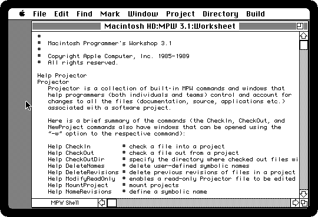

8. **Select all of it and type the commands**, one at a time, each sent with
   **Enter**: the Enter of the numeric keypad, or Command and Return together
   on a keyboard with no keypad. Return alone only starts a new line, as in
   any text.

   ```
   Directory "For the Mac:"
   C Mandelbrot.c
   Link -o Mandelbrot Mandelbrot.c.o "{Libraries}"Interface.o "{CLibraries}"CRuntime.o "{CLibraries}"CInterface.o -t APPL -c '????'
   ```

   *Directory* makes the folder the one the commands work in: `For the Mac:`
   is the folder, a volume of its own on the desktop, named with the colon
   that ends a volume's name on the Macintosh. *C* compiles the program into
   `Mandelbrot.c.o`, in under a minute. *Link* puts that together with three
   libraries of MPW: the Toolbox's calls, the start of a C program, and its
   glue to the Toolbox. `{Libraries}` and `{CLibraries}` are variables of the
   Shell, the folders they are in. `-t APPL` makes the file an application,
   and `-c '????'` gives it no creator of its own. The commands say nothing
   when all goes well; a mistake in the program stops the compiler with the
   line and what is wrong with it.

   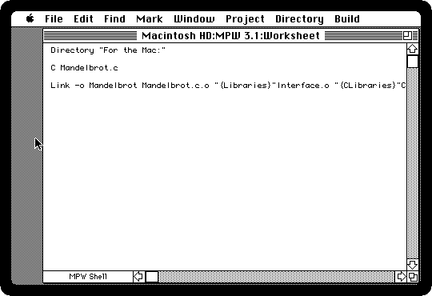

   The program is in the folder *For the Mac* on your computer too, next to
   its source: the compiler and the linker wrote there, over the network.

## Explore

The pictures take minutes to draw on a Macintosh Plus, as they did. To wait
less, press **F5**: izmac runs as fast as your computer can, and F5 again
brings it back to the speed of the Plus.

9. **Type `Mandelbrot` and press Enter.** A command that is not one of the
   Shell's is a program, which it runs. The picture comes a row at a time,
   in about three minutes on a Macintosh Plus, shown here ten times as fast.

   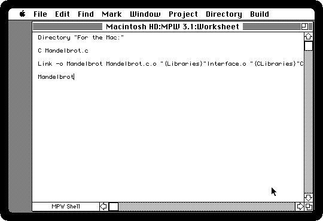

10. **Move the pointer over the picture.** The line at the bottom of the
    window says where it is on the plane, across and up, and what that point
    does: *in the set*, or *out after* so many times round.

    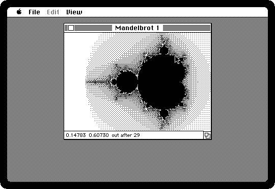

11. **Drag a rectangle around the left end of the line** that runs out of the
    set. Its outline follows the mouse, and when the button is let go, that
    part is drawn in a window of its own.

    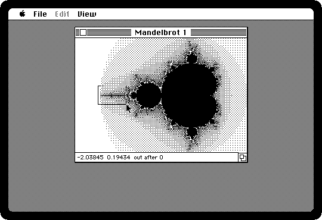

    Along the line are smaller blobs, which are not blobs.

    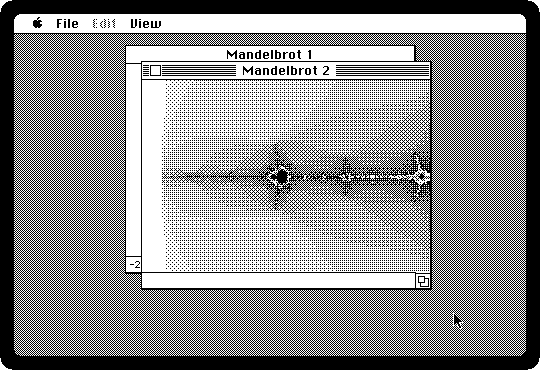

12. **Drag a rectangle around the black one in the middle**, in the new
    window. It is the whole set again, a copy many times smaller, with its own
    bands around it. It takes about eleven minutes: the black is most of the
    picture now, and every point of it goes round all 64 times.

    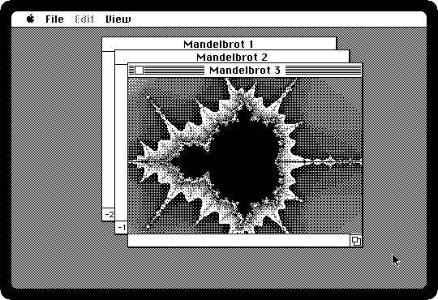

    *Zoom Out* in the View menu, or Command and the minus key, takes the
    front window further out, and *Whole Set*, or Command-R, to the whole set.
    *New*, in the File menu, opens another window on the whole set, and
    *Close*, or the box at the top left of a window, closes it.

13. **Choose Black and White from the View menu**, or press Command-B. Every
    window starts again, with the points of the set in black and every other
    point in white, however long it took to get out: the set itself, with
    nothing around it.

    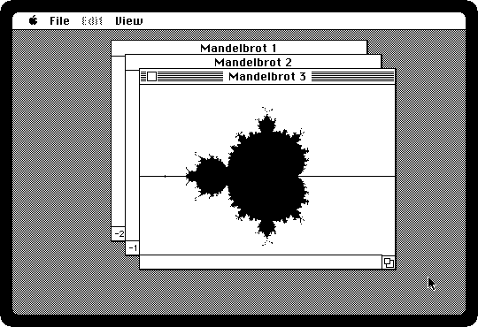

14. **Close the two new windows and drag the box at the bottom right of the
    first** to make it bigger. The picture starts again, the size of the
    window, with the same point in its middle.

    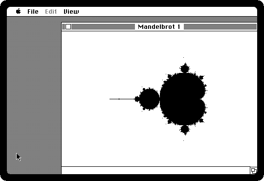

15. **Choose Quit from the File menu**, or press Command-Q. The MPW Shell
    comes back, ready for the next change to the program.

## What next

The same MPW compiles Pascal, with `Pascal` in place of `C`, and assembly
language, with `Asm`, and its *Examples* folder has the sample programs Apple
gave its developers, each with the commands that build it. The MPW 3.0
manuals are on the Internet Archive, starting with
[the Reference](https://archive.org/details/bitsavers_applemacdenceVolume11988_30969146).
[Writing a game in THINK Pascal](think-pascal.md) is the other way programs
were written, with the editor, the compiler and the debugger in one
application.
