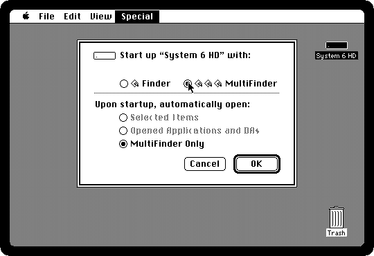
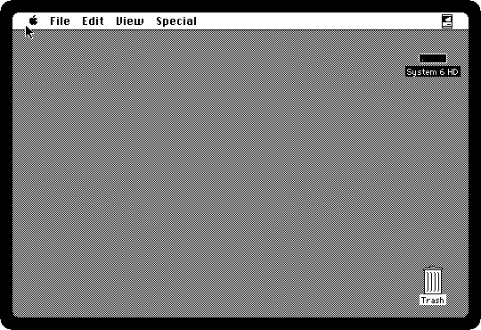
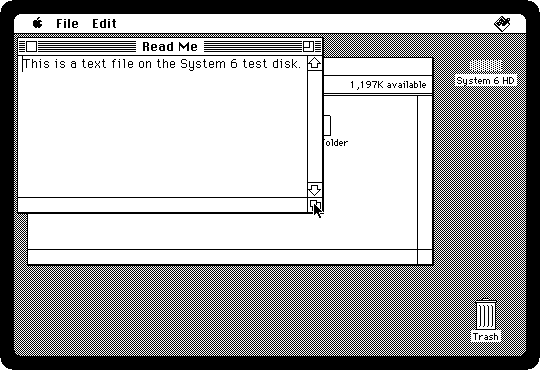
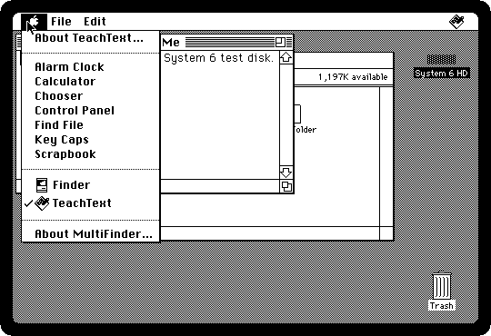

# MultiFinder: more than one program at a time

[Back to the activities](README.md)

For its first three years the Macintosh ran one application at a time, and the
Finder was one of them: opening a program closed the Finder, and quitting it
brought the Finder back. In 1987 System 5.0 brought **MultiFinder**, which
kept several programs open at once, each in its own part of the memory,
with the Finder among them. A click on a window of another program brought
that program to the front, with its own menus.

It was optional, chosen with *Set Startup*, because it needed memory: a
Macintosh Plus came with one megabyte, and owners who wanted MultiFinder
added more. This is System 6, on a Plus with the four megabytes that were the
most it could take.

## What you need

The same disk as [Desk accessories and the Clipboard](desk-accessories.md):
download **`system6.img`** from izmac's repository, by opening
[test_images/system6.img](https://github.com/ivanizag/izmac/blob/main/test_images/system6.img)
and clicking *Download raw file*.

## Turn MultiFinder on

1. **Start izmac with four megabytes**:

   ```bash
   izmac -ram 4096 system6.img
   ```

2. **Choose Set Startup from the Special menu**, and click **MultiFinder**.
   The choices below it are what to open by itself at startup; leave them as
   they are, and click OK.

   

3. **Choose Restart from the Special menu.** The Macintosh starts again, and
   the Finder looks the same but for the small icon at the right of the menu
   bar, which is the program in front.

   

## Several programs at once

4. **Open the disk and double-click Read Me.** TeachText opens it, and the
   Finder is still running behind it. Drag the box at the bottom right of the
   window of TeachText to make it smaller, until the window of the disk shows
   behind it.

5. **Click on the window of the disk.** The Finder comes to the front, with
   its menus, and the window of TeachText stays where it was, behind. Click on
   the title of the window of TeachText, and TeachText comes back.

   

   The icon at the right of the menu bar changes with every switch. What is
   in front is the program whose menus are in the menu bar.

6. **Pull down the Apple menu.** Under the desk accessories are the programs
   running, the one in front ticked: choosing one is another way to switch.

   

7. **Go to the Finder and choose About the Finder** from the Apple menu. The
   bars are the memory, each program's own part of it and how much of that it
   is using: TeachText, the Finder and the System, and the largest block left
   for another program.

   

   On a Macintosh of one megabyte there was room for the Finder and one
   program more. Each program says how much it wants in its Get Info window,
   and under MultiFinder that was a setting worth knowing.

## Back to the Finder alone

8. To go back, choose *Set Startup* again, click **Finder**, and restart.
   Many owners of a one megabyte Plus did: the single Finder left all the
   memory to the one program running.

## What next

[Desk accessories and the Clipboard](desk-accessories.md) is how the same
System got by with one program at a time, and [Installing System 6 on a hard
disk](installing.md) is where this System came from.
