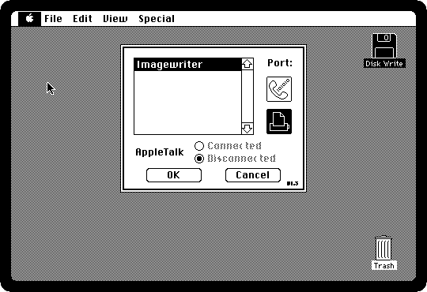
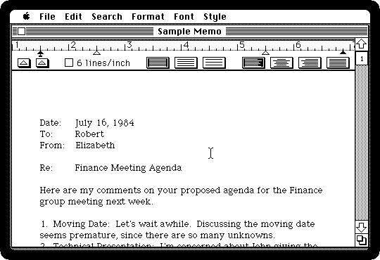
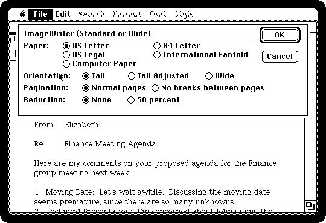
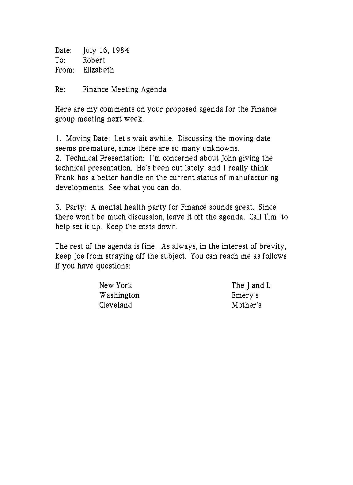

# Printing on the ImageWriter

[Back to the activities](README.md)

Beside most Macintoshes of the eighties was an **ImageWriter**, Apple's dot
matrix printer: a head of nine pins (eight of them used) going back and forth
over a ribbon, on paper with holes down both sides, pulled through by the
tractor feed and torn off at the perforations. It printed the Macintosh's
screen dot for dot, which is what made a printed page look like the one on
the screen, and it made a noise that filled an office.

How good a page looked was a choice made every time: fast and rough, or slow
and fine. This is the same memo printed the three ways the ImageWriter
offered, from MacWrite 4.5.

## What you need

**`macwrite.dsk`**, the MacWrite diskette, with the ImageWriter driver on it:
from izmac's repository, open
[test_images/macwrite.dsk](https://github.com/ivanizag/izmac/blob/main/test_images/macwrite.dsk)
and click *Download raw file*. izmac has an ImageWriter on its printer port
from the start, and writes the pages it prints as images.

## Choose the printer

1. **Start izmac with the diskette**:

   ```bash
   izmac macwrite.dsk
   ```

2. **Choose Choose Printer from the Apple menu.** The printers whose drivers
   are on the System diskette are on the left: here only the Imagewriter. The
   two icons on the right are the ports at the back of the Macintosh, the
   modem's and the printer's. Click OK.

   

   This desk accessory soon became the Chooser, which found printers on
   AppleTalk as well, shared by the office.

## Set up the page

3. **Open the diskette and double-click Sample Memo.** MacWrite opens with
   it.

   

4. **Choose Page Setup from the File menu.** The paper, American or
   European, or the computer paper of fanfold printers; the orientation, with
   *Tall Adjusted* for pictures that keep their proportions; and *50 percent*
   to print it at half size. Click OK.

   

## Print, three ways

5. **Choose Print from the File menu**, click **Draft** and OK.

   

6. **Print it again in Standard, and again in High.** Each page comes out
   beside izmac as an image: `izmac_page_001.png`, `002` and `003`. Side by
   side:

   

   - **Draft** sends the words as letters, which the printer prints in its own
     font at each place the Macintosh asks: no fonts of the Macintosh, no
     sizes, no styles, but by far the fastest, with the head going across a
     line once.
   - **Standard** sends the page as the Macintosh draws it on the screen, at
     72 dots to the inch, a strip of graphics at a time: the fonts and
     everything else as on the screen.
   - **High** draws the page at twice the size, with fonts of twice the size
     where the System has them, and prints it at 144 dots to the inch, which
     takes two passes of the head for every line. It took several times as
     long as Draft.

7. The high quality page whole:

   

   [Printing](../printing.md) is what izmac's ImageWriter does, and where the
   pages go.

## What next

[Writing a letter in MacWrite](macwrite.md) is a letter of your own to print,
and [Drawing in MacPaint](macpaint.md) is how a picture prints.
