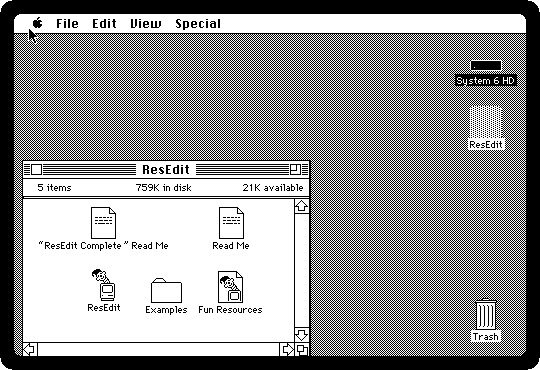
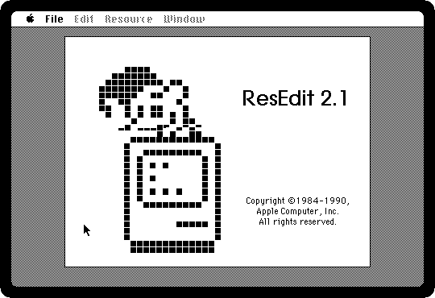
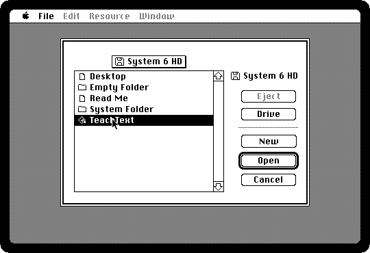
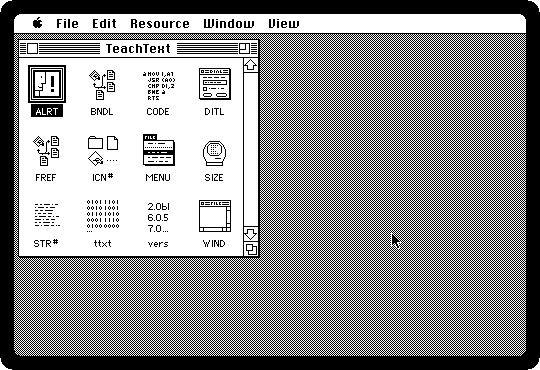
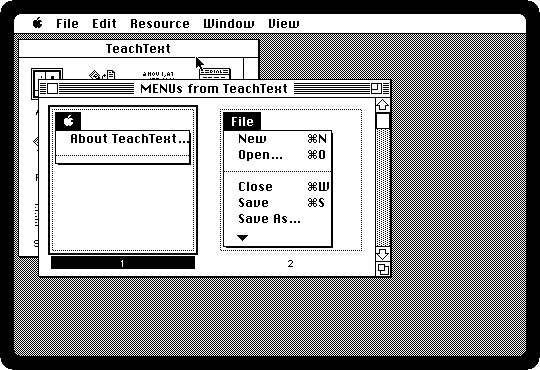
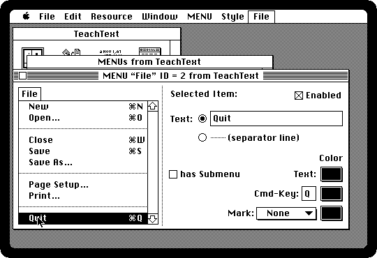

# Changing a program with ResEdit

[Back to the activities](README.md)

A Macintosh program is not only code. Its menus, its dialogs, its icons, its
pictures, the words of its alerts, are kept apart from the code, in its
**resources**, so that a program could be translated into another language
without touching the code, by changing the words. Apple's tool for looking at
them and changing them was **ResEdit**, and it became the favourite of every
curious owner of a Macintosh: a new icon for the Trash, a beep replaced, a
program's menus renamed.

This is ResEdit 2.1, of 1990, changing a word in a menu of TeachText.

## What you need

- **`system6.img`**, System 6 on a small hard disk, from izmac's repository:
  open
  [test_images/system6.img](https://github.com/ivanizag/izmac/blob/main/test_images/system6.img)
  and click *Download raw file*.
- **ResEdit 2.1**, the diskette that came with the book *ResEdit Complete*, in
  the [ResEdit 2.1 item](https://archive.org/details/apple-res-edit-2.1-for-mac-addison-wesley-edition-2.1-1990-12-english-3.5-800-k)
  of the Internet Archive: download its zip, the first file, as it is.
- For the StuffIt archive inside the zip, **unar**: `brew install unar` on
  macOS, `unar` in the package manager of most Linux distributions.

## Open TeachText in ResEdit

1. **Start izmac with the System and the zip**, and four megabytes:

   ```bash
   izmac -ram 4096 system6.img "Apple ResEdit 2.1 for Mac Addison-Wesley Edition (2.1) (1990-12) [English] (3.5''-800K).zip"
   ```

   izmac finds the diskette inside the StuffIt archive inside the zip, and
   leaves out the scans of the box. The diskette goes in the drive once the
   Macintosh has started from its hard disk.

   

2. **Double-click ResEdit.** It starts with its jack in the box.

   

3. **Click, and open TeachText**: click Drive until the hard disk, *System 6
   HD*, is the one listed, click TeachText, and Open.

   

   *Changing a program can break it.* On a real Macintosh the first thing to
   do was a copy of it; here the hard disk is a file, and a copy of
   `system6.img` is the copy.

4. **These are TeachText's resources**, by type: **ALRT** and **DITL** are
   its alerts and the items in them, **ICN#** its icons, **MENU** its menus,
   **STR#** its words, **vers** its version, **CODE** the code itself.

   

## Rename a menu item

5. **Click MENU, and choose Open MENU Picker from the Resource menu.** The
   menus of TeachText, the Apple menu and File.

   

6. **Click the File menu and choose Open Resource Editor from the Resource
   menu.** ResEdit puts the menu being edited in the menu bar too, at the
   right, to try as it changes.

7. **Click Quit**, the last item, select its text on the right, and type
   *Goodbye*. Then pull down the File menu at the right of the menu bar.

   

8. **Choose Save from the File menu**, and quit ResEdit.

## The change

9. **Open the hard disk and double-click TeachText**, and pull down its File
   menu.

   

   Nothing in its code changed: the code asks for the menu, and the menu
   comes from the resource. The *Fun Resources* on the ResEdit diskette are
   others to look at, and the *Examples* are what the book did with them.

## What next

[HyperCard](hypercard.md) is the other way a Macintosh owner made the machine
do something new, and [Software from the archives](archives.md) is where most
of the programs to look inside came from.
