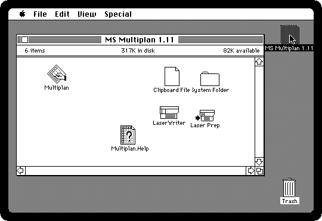
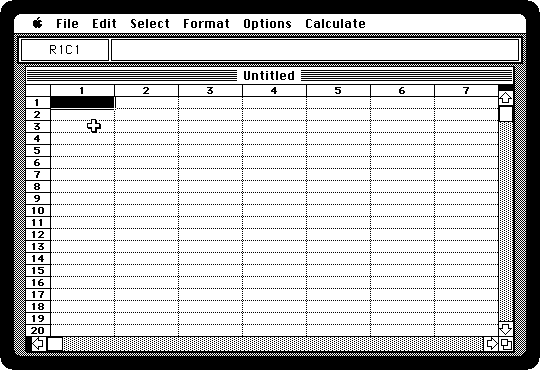
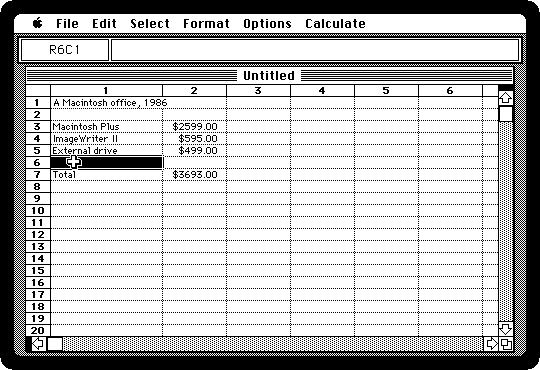
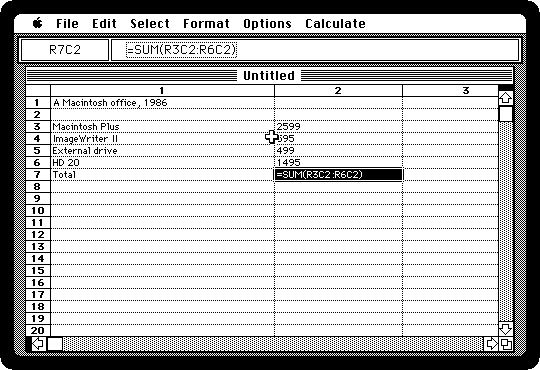

# A spreadsheet in Multiplan

[Back to the activities](README.md)

The spreadsheet was what made people buy personal computers in the first
place: VisiCalc, on the Apple II in 1979, turned the paper ledger of an
accountant into a grid of cells that added themselves up again whenever a
number changed. When the Macintosh came out in 1984 Microsoft had one ready
for it, **Multiplan**, one of the first programs anyone could buy for the
machine, until Microsoft's own Excel took its place in 1985.

This is a budget in Multiplan 1.11: the things an office bought in 1986 to
start with a Macintosh, their prices, and a total that is a formula.

## What you need

**`multiplan.dsk`**, the Multiplan diskette, with its own System: from izmac's
repository, open
[test_images/multiplan.dsk](https://github.com/ivanizag/izmac/blob/main/test_images/multiplan.dsk)
and click *Download raw file*. It is the
[Multiplan 1.11 diskette](https://archive.org/details/mac_MSMultiplan_1.11) of
the Internet Archive.

## Fill it in

1. **Start izmac with the diskette**, and open it:

   ```bash
   izmac multiplan.dsk
   ```

   

2. **Double-click Multiplan.** It opens an empty worksheet. The cells are
   named by row and column, **R1C1** for the first: the box at the top left
   says which cell is chosen, and the box beside it what is in it.

   

3. **Click a cell and type**, and press Return to go to the cell below, or Tab
   to the one on the right. Type a title in R1C1, and from R3C1 down the
   things bought: *Macintosh Plus*, *ImageWriter II*, *External drive*, and
   *Total* in R7C1. In the second column, from R3C2, their prices in
   dollars, as they were in 1986: *2599*, *595*, *499*.

4. **The total is a formula**: click R7C2 and type `=SUM(R3C2:R6C2)`, which
   adds up the cells from R3C2 to R6C2, the empty row included.

5. **Format the numbers as money**: click the *2* at the top of the second
   column, which selects all of it, and choose **Dollar** from the Format
   menu. Then click the *1* of the first column, choose **Column Width** from
   the Format menu, and make it *18*, wide enough for the names.

   

## Change it

6. **Add a line**: click R6C1, the empty row, type *HD 20*, press Tab, and
   type *1495*, the price of Apple's hard disk. The total follows as soon as
   the number is in.

   

   That was the whole point of a spreadsheet: change any number, and every
   cell that depends on it is worked out again, which on paper meant doing
   the sums all over.

7. **Choose Show Formulas from the Options menu.** The cells show what they
   are instead of what they come to: the prices are numbers, and the total
   is the formula. *Show Values* goes back.

   

## What next

[Writing a letter in MacWrite](macwrite.md) is the other half of the office,
and [Programming in BASIC](basic.md) is how people made the computer work out
things no program did for them.
