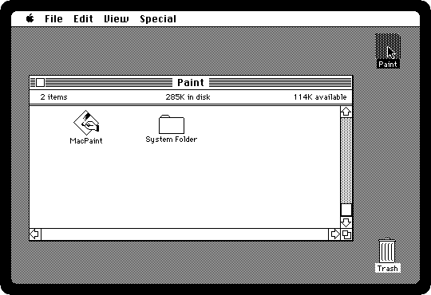
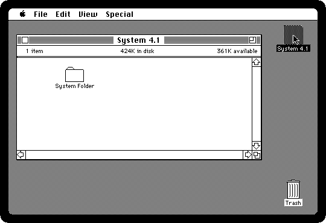
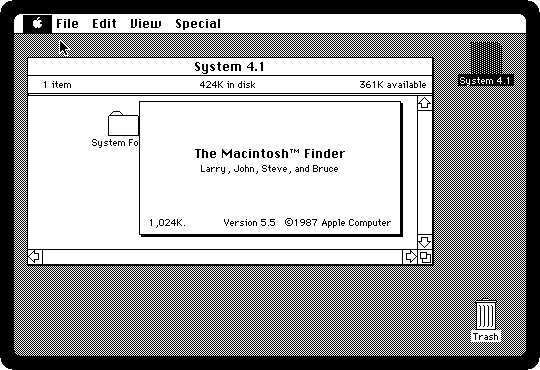
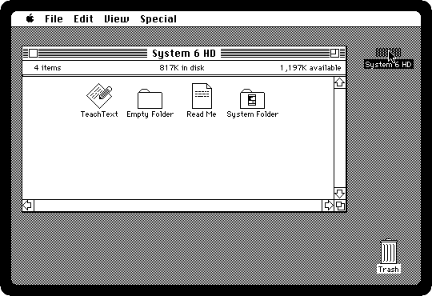
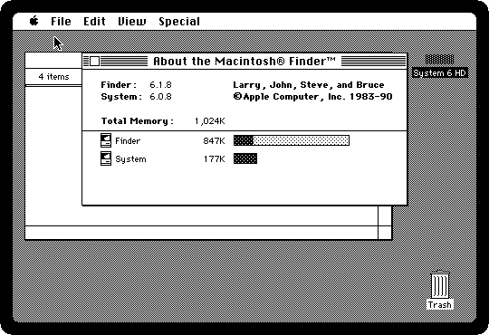
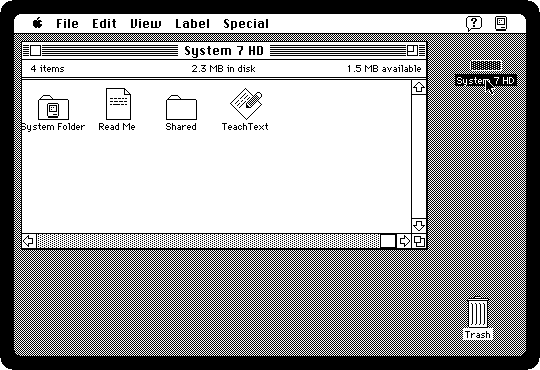
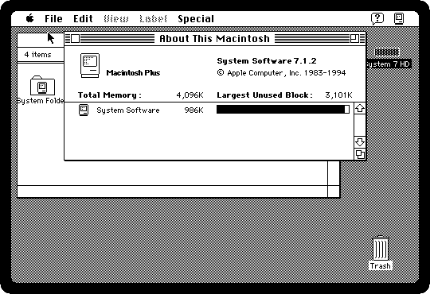

# From System 2 to System 7

[Back to the activities](README.md)

The Macintosh Plus was sold from 1986 to 1990, and it ran the System
software of Apple for years after that: every version from the one it came
out with up to System 7.5. An owner who kept upgrading saw the same machine
grow folders inside folders, a hard disk, several programs at once, and in
the end colour menus it could not show, aliases and balloons of help.

This page starts the same Macintosh Plus four times, with a System of each
period, and compares the Finder, the program that is the desktop, and what it
says about itself.

## What you need

From izmac's repository, open each of these and click *Download raw file*:

- [macpaint.dsk](https://github.com/ivanizag/izmac/blob/main/test_images/macpaint.dsk),
  System 2.0, which izmac also downloads by itself when started with nothing;
- [system41.dsk](https://github.com/ivanizag/izmac/blob/main/test_images/system41.dsk),
  System 4.1;
- [system6.img](https://github.com/ivanizag/izmac/blob/main/test_images/system6.img),
  System 6.0.8;
- [system7.img](https://github.com/ivanizag/izmac/blob/main/test_images/system7.img),
  System 7.1.2.

Start izmac with each in turn, `izmac macpaint.dsk`, and so on, and with
`-ram 4096` for System 7, which needs it. For each, open the startup disk and
choose the first item of the Apple menu.

## 1985: System 2.0

The System of the Macintosh 512K, the year before the Plus, here on a 400K
diskette with MacPaint. The disk is **MFS**, the first file system
of the Macintosh, which kept all the files of a disk in one list: the folders
are drawn by the Finder and exist only for it. The Finder 4.1 is by Bruce Horn
and Steve Capps, who wrote the first one.

[The 1984 experience](first-steps.md) goes through it.

## 1987: System 4.1

The **HFS** of the Plus's own ROM, the hierarchical file system, with real
folders that can hold thousands of files, which a hard disk needed. The
Finder 5.5 is by "Larry, John, Steve, and Bruce", and its Special menu has
*Set Startup*, to choose what opens when the machine starts.

## 1991: System 6.0.8

The last System 6, on a small hard disk: the System most Plus owners ended
up with. About the Finder now shows the memory, how much each program takes,
which mattered with MultiFinder.

[Desk accessories and the Clipboard](desk-accessories.md) and
[MultiFinder](multifinder.md) go through it.

## 1994: System 7.1.2

System 7, of 1991, the biggest change the System ever had, still running on
a Plus with four megabytes: the Label menu, the Help menu with its balloon at
the right, and the menu of the running programs beside it, MultiFinder become
part of the System. The Apple menu is a folder, *Apple Menu Items*, where
anything put in it appears. About This Macintosh says which Macintosh it is,
a *Macintosh Plus*.

[Two Macs sharing files](file-sharing.md) is what System 7 brought to every
Macintosh.

## What next

[Installing System 6 on a hard disk](installing.md) is how an owner moved from
one System to the next.
