# Writing a game in THINK Pascal

[Back to the activities](README.md)

Pascal was the language of the Macintosh. The software of the Lisa was
written in it, and so was most of MacPaint, and *Inside Macintosh*, the books that
told programmers how the machine worked, gave every routine of the Toolbox
as a Pascal procedure. Programmers of the late eighties who wanted
more than BASIC, without writing in assembly language, wrote their programs
in Pascal, and many of them did it in **THINK Pascal**. It was Lightspeed
Pascal when THINK Technologies brought it out, and Symantec kept it going
under the THINK name. Its editor, compiler and debugger were one
application: a program was typed, run and stopped without leaving it, as
quickly as in BASIC, and became a real Macintosh application at the end.

This page writes a game from nothing in THINK Pascal 4.0, of 1991: **2048**,
which came out more than twenty years later. Four rows of four squares hold
tiles with numbers, the arrow keys slide them all one way, and two tiles of
the same number that meet become one, of their sum. Its rules fit in a
few hundred lines of Pascal, and it plays well in black and white.

## What you need

- **`system6.dsk`**, System 6 on a diskette with the AppleShare part of the
  Chooser on it, from izmac's repository: open
  [test_images/system6.dsk](https://github.com/ivanizag/izmac/blob/main/test_images/system6.dsk)
  and click *Download raw file*.
- **A hard disk.** THINK Pascal does not fit on a diskette, and says so. The
  one made in [Installing System 6 on a hard disk](installing.md),
  `blank.img`, is the one used here. Only its space is needed: the Macintosh
  starts from `system6.dsk`, because the System installed on the hard disk
  has no AppleShare to reach the file server with.
- **The first two diskettes of THINK Pascal 4.0**, from izmac's repository:
  [test_images/thinkpascal-1.dsk](https://github.com/ivanizag/izmac/blob/main/test_images/thinkpascal-1.dsk)
  and
  [test_images/thinkpascal-2.dsk](https://github.com/ivanizag/izmac/blob/main/test_images/thinkpascal-2.dsk).
  They are the `disk01.img` and `disk02.img` of the set of four that
  [WinWorld](https://winworldpc.com/product/think-pascal) keeps; the other
  two have the class library, MacApp and ResEdit, which this page does not
  use.
- **A folder to share**, called *For the Mac*, where the program will be
  written, with any text editor of your computer.

## Install THINK Pascal

1. **Start izmac** with four megabytes, the System diskette, the second
   THINK Pascal diskette, the hard disk and the folder:

   ```bash
   izmac -ram 4096 -share "For the Mac" system6.dsk thinkpascal-2.dsk blank.img
   ```

   The Macintosh starts from the first diskette, and the second goes in the
   other drive. The hard disk, *Macintosh HD*, is on the desktop too, and
   the window of THINK Pascal 2 opens by itself.

   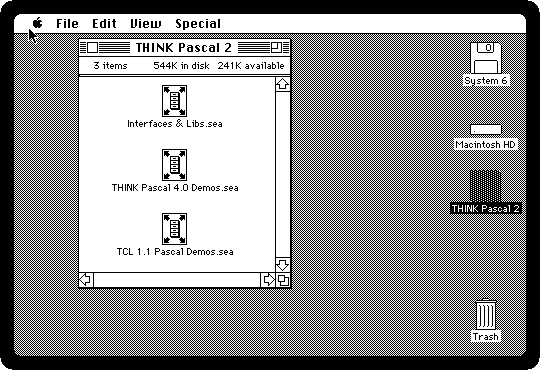

2. **Double-click Interfaces & Libs.sea.** The files of THINK Pascal came
   packed into *self-extracting archives*, applications that unpack
   themselves, so that they took fewer diskettes. This one asks where to
   put what it has. **Click Drive** until the name over the list is
   *Macintosh HD*, which has your System Folder in it.

   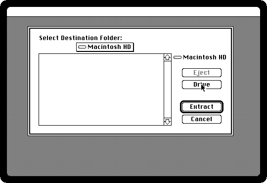

3. **Click Extract.** The archive writes a folder, *THINK Pascal 4.0
   Folder*, on the hard disk, file by file, and quits when it is done:
   about five minutes on a Macintosh Plus.

   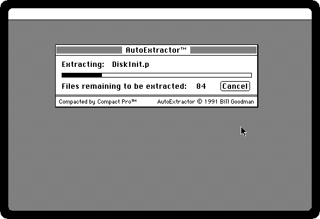

4. **Swap the diskettes**: drag the icon of THINK Pascal 2 to the Trash,
   which ejects it for good, and drag `thinkpascal-1.dsk` onto the izmac
   window. THINK Pascal 1 has the application itself, and its window opens.

5. **Open Macintosh HD and its THINK Pascal 4.0 Folder, and drag THINK
   Pascal 4.0 from the window of the diskette into the folder.** The
   application has to be in the same folder as the libraries the archive
   unpacked, *Runtime.Lib* and *Interface.Lib*, which every program is built
   with, and the *Interfaces* of the Toolbox. The copy takes about 25
   seconds.

   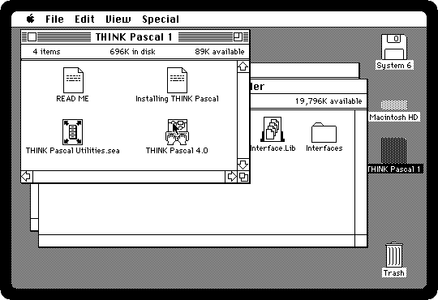

## The program

6. **Write the program in a file, `2048.p`, in the folder *For the Mac*.**
   The blocks of Pascal of this section, one after the other, are the whole
   of it. Copy them into the file with any text editor of your computer.

The program begins by naming what it uses. The constants are the sizes of the
board in pixels, the numbers of the menus and their items, and the codes of
the characters the four arrow keys type. The board is an array of four rows of
four numbers, with 0 for an empty square.

```pascal
program Game2048;

const
  TileSize = 52;
  Gap = 6;
  BoardLeft = 8;
  BoardTop = 30;
  WindowWidth = 254;
  WindowHeight = 276;
  AppleID = 128;
  FileID = 129;
  EditID = 130;
  NewItem = 1;
  QuitItem = 3;
  LeftArrow = 28;
  RightArrow = 29;
  UpArrow = 30;
  DownArrow = 31;

type
  Board = array[1..4, 1..4] of LongInt;
  Four = array[1..4] of LongInt;

var
  tiles: Board;
  score: LongInt;
  won, over, quitting: Boolean;
  window: WindowPtr;
  appleMenu, fileMenu, editMenu: MenuHandle;
```

A new tile is a 2, or a 4 one time in ten, on an empty square picked at
random. `Random` is QuickDraw's, which gives a number between -32767 and
32767. A new game is an empty board with two tiles on it.

```pascal
procedure AddTile;
  var
    row, col, empty, pick: Integer;
begin
  empty := 0;
  for row := 1 to 4 do
    for col := 1 to 4 do
      if tiles[row, col] = 0 then
        empty := empty + 1;
  if empty > 0 then
    begin
      pick := Abs(Random) mod empty;
      for row := 1 to 4 do
        for col := 1 to 4 do
          if tiles[row, col] = 0 then
            begin
              if pick = 0 then
                if Abs(Random) mod 10 = 0 then
                  tiles[row, col] := 4
                else
                  tiles[row, col] := 2;
              pick := pick - 1;
            end;
    end;
end;

procedure NewGame;
  var
    row, col: Integer;
begin
  for row := 1 to 4 do
    for col := 1 to 4 do
      tiles[row, col] := 0;
  score := 0;
  won := false;
  over := false;
  AddTile;
  AddTile;
end;
```

The heart of the game is one line of four squares slid towards its first
square. The tiles are taken in order and put one after the other; a tile equal
to the last one put, if that one has not been joined already, joins it
instead, doubled, and adds to the score. It says whether anything moved,
because a slide that moves nothing is not a move.

```pascal
function SlideLine (var squares: Four): Boolean;
  var
    result: Four;
    i, count: Integer;
    joined: Boolean;
begin
  for i := 1 to 4 do
    result[i] := 0;
  count := 0;
  joined := false;
  for i := 1 to 4 do
    if squares[i] <> 0 then
      if (count > 0) and not joined and (result[count] = squares[i]) then
        begin
          result[count] := result[count] * 2;
          score := score + result[count];
          if result[count] = 2048 then
            won := true;
          joined := true;
        end
      else
        begin
          count := count + 1;
          result[count] := squares[i];
          joined := false;
        end;
  SlideLine := false;
  for i := 1 to 4 do
    begin
      if result[i] <> squares[i] then
        SlideLine := true;
      squares[i] := result[i];
    end;
end;
```

A move slides the four rows, or the four columns, all the same way. The
procedure *Square*, inside *Slide*, says which square of the board is the i-th
of the k-th line for each of the four arrows, so that one *SlideLine* does all
four directions. The game is over when no square is empty and no two tiles
side by side are equal.

```pascal
function Slide (key: Integer): Boolean;
  var
    k, i, row, col: Integer;
    squares: Four;
    moved: Boolean;

  procedure Square (k, i: Integer; var row, col: Integer);
  begin
    case key of
      LeftArrow:
        begin
          row := k;
          col := i;
        end;
      RightArrow:
        begin
          row := k;
          col := 5 - i;
        end;
      UpArrow:
        begin
          row := i;
          col := k;
        end;
      DownArrow:
        begin
          row := 5 - i;
          col := k;
        end;
    end;
  end;

begin
  moved := false;
  for k := 1 to 4 do
    begin
      for i := 1 to 4 do
        begin
          Square(k, i, row, col);
          squares[i] := tiles[row, col];
        end;
      if SlideLine(squares) then
        moved := true;
      for i := 1 to 4 do
        begin
          Square(k, i, row, col);
          tiles[row, col] := squares[i];
        end;
    end;
  Slide := moved;
end;

function CanMove: Boolean;
  var
    row, col: Integer;
begin
  CanMove := false;
  for row := 1 to 4 do
    for col := 1 to 4 do
      begin
        if tiles[row, col] = 0 then
          CanMove := true;
        if (col < 4) and (tiles[row, col] = tiles[row, col + 1]) then
          CanMove := true;
        if (row < 4) and (tiles[row, col] = tiles[row + 1, col]) then
          CanMove := true;
      end;
end;
```

The drawing is QuickDraw's, in black and white, as everything on the Plus. A
tile is a rounded rectangle, darker the bigger its number: white for 2 and 4,
then the light gray, gray and dark gray patterns, with the number on a small
white plate so that it can be read, and black with the number in white from
512 up. An empty square is only its outline, in gray. Above the board are the
score and, at the end, a message.

```pascal
procedure DrawTile (row, col: Integer);
  var
    box, plate: Rect;
    number: Str255;
    value: LongInt;
begin
  SetRect(box, 0, 0, TileSize, TileSize);
  OffsetRect(box, BoardLeft + Gap + (col - 1) * (TileSize + Gap), BoardTop + Gap + (row - 1) * (TileSize + Gap));
  EraseRoundRect(box, 12, 12);
  value := tiles[row, col];
  if value = 0 then
    begin
      PenPat(gray);
      FrameRoundRect(box, 12, 12);
      PenNormal;
    end
  else
    begin
      if value >= 512 then
        FillRoundRect(box, 12, 12, black)
      else if value >= 128 then
        FillRoundRect(box, 12, 12, dkGray)
      else if value >= 32 then
        FillRoundRect(box, 12, 12, gray)
      else if value >= 8 then
        FillRoundRect(box, 12, 12, ltGray);
      FrameRoundRect(box, 12, 12);
      NumToString(value, number);
      if (value >= 8) and (value < 512) then
        begin
          SetRect(plate, 0, 0, StringWidth(number) + 10, 18);
          OffsetRect(plate, box.left + (TileSize - plate.right) div 2, box.top + (TileSize - 18) div 2);
          EraseRoundRect(plate, 8, 8);
          FrameRoundRect(plate, 8, 8);
        end;
      if value >= 512 then
        TextMode(srcBic);
      MoveTo(box.left + (TileSize - StringWidth(number)) div 2, box.top + TileSize div 2 + 5);
      DrawString(number);
      TextMode(srcOr);
    end;
end;

procedure DrawScore;
  var
    strip: Rect;
    number: Str255;
begin
  SetRect(strip, 0, 0, WindowWidth, BoardTop);
  EraseRect(strip);
  NumToString(score, number);
  MoveTo(BoardLeft + Gap, 20);
  DrawString(concat('Score: ', number));
  if over then
    number := 'Game over'
  else if won then
    number := 'You made 2048!'
  else
    number := '';
  MoveTo(WindowWidth - BoardLeft - Gap - StringWidth(number), 20);
  DrawString(number);
end;

procedure DrawBoard;
  var
    row, col: Integer;
begin
  SetPort(window);
  DrawScore;
  for row := 1 to 4 do
    for col := 1 to 4 do
      DrawTile(row, col);
end;
```

The rest is what every Macintosh program had to do for itself. The menus are
handled here: the Apple menu with *About 2048* and the desk accessories, the
File menu, and the Edit menu, which is only there for the desk accessories. A
key slides the tiles: the arrows, and also W, A, S and D. A click is taken
where it fell: on the menu bar, on the title bar to drag the window, on its
close box to quit, or on a desk accessory.

```pascal
procedure ShowAbout;
  var
    box: Rect;
    about: WindowPtr;
begin
  HiliteMenu(0);
  SetRect(box, 106, 110, 406, 190);
  about := NewWindow(nil, box, '', true, dBoxProc, WindowPtr(-1), false, 0);
  SetPort(about);
  MoveTo(20, 30);
  DrawString('2048, written in THINK Pascal.');
  MoveTo(20, 55);
  DrawString('Click to go back to the game.');
  repeat
    SystemTask;
  until Button;
  repeat
  until not Button;
  FlushEvents(everyEvent, 0);
  DisposeWindow(about);
  SetPort(window);
end;

procedure DoMenu (choice: LongInt);
  var
    item: Integer;
    name: Str255;
begin
  item := LoWord(choice);
  case HiWord(choice) of
    AppleID:
      if item = 1 then
        ShowAbout
      else
        begin
          GetItem(appleMenu, item, name);
          item := OpenDeskAcc(name);
        end;
    FileID:
      if item = NewItem then
        begin
          NewGame;
          DrawBoard;
        end
      else if item = QuitItem then
        quitting := true;
    EditID:
      if SystemEdit(item - 1) then
        ;
  end;
  HiliteMenu(0);
end;

procedure DoKey (key: Integer);
begin
  case chr(key) of
    'a', 'A':
      key := LeftArrow;
    'd', 'D':
      key := RightArrow;
    'w', 'W':
      key := UpArrow;
    's', 'S':
      key := DownArrow;
    otherwise
  end;
  if not over and ((key = LeftArrow) or (key = RightArrow) or (key = UpArrow) or (key = DownArrow)) then
    if Slide(key) then
      begin
        AddTile;
        over := not CanMove;
        DrawBoard;
      end;
end;

procedure DoMouseDown (event: EventRecord);
  var
    part: Integer;
    which: WindowPtr;
    limits: Rect;
begin
  part := FindWindow(event.where, which);
  case part of
    inMenuBar:
      DoMenu(MenuSelect(event.where));
    inSysWindow:
      SystemClick(event, which);
    inDrag:
      begin
        limits := screenBits.bounds;
        InsetRect(limits, 4, 4);
        DragWindow(which, event.where, limits);
      end;
    inGoAway:
      if TrackGoAway(which, event.where) then
        quitting := true;
    inContent:
      if which <> FrontWindow then
        SelectWindow(which);
  end;
end;
```

And the start: the managers of the Toolbox started one by one, the menus made
in the program rather than in a resource file, so that the whole program is in
this one file, and the window. Then the *event loop*, which asks for the next
thing that happened, a click, a key or a window to draw again, and deals with
it, until the game is quit.

```pascal
procedure Setup;
  var
    box: Rect;
    title: Str255;
begin
  InitGraf(@thePort);
  InitFonts;
  InitWindows;
  InitMenus;
  TEInit;
  InitDialogs(nil);
  InitCursor;
  FlushEvents(everyEvent, 0);
  title := ' ';
  title[1] := chr(appleMark);
  appleMenu := NewMenu(AppleID, title);
  AppendMenu(appleMenu, 'About 2048...;(-');
  AddResMenu(appleMenu, 'DRVR');
  InsertMenu(appleMenu, 0);
  fileMenu := NewMenu(FileID, 'File');
  AppendMenu(fileMenu, 'New Game/N;(-;Quit/Q');
  InsertMenu(fileMenu, 0);
  editMenu := NewMenu(EditID, 'Edit');
  AppendMenu(editMenu, 'Undo/Z;(-;Cut/X;Copy/C;Paste/V;Clear');
  InsertMenu(editMenu, 0);
  DrawMenuBar;
  SetRect(box, 0, 0, WindowWidth, WindowHeight);
  OffsetRect(box, (512 - WindowWidth) div 2, 50);
  window := NewWindow(nil, box, '2048', true, noGrowDocProc, WindowPtr(-1), true, 0);
  SetPort(window);
  TextFont(systemFont);
  randSeed := TickCount;
  NewGame;
end;

procedure Run;
  var
    event: EventRecord;
begin
  quitting := false;
  repeat
    SystemTask;
    if GetNextEvent(everyEvent, event) then
      case event.what of
        mouseDown:
          DoMouseDown(event);
        keyDown, autoKey:
          if BitAnd(event.modifiers, cmdKey) <> 0 then
            DoMenu(MenuKey(chr(BitAnd(event.message, charCodeMask))))
          else
            DoKey(BitAnd(event.message, charCodeMask));
        updateEvt:
          begin
            BeginUpdate(WindowPtr(event.message));
            DrawBoard;
            EndUpdate(WindowPtr(event.message));
          end;
      end;
  until quitting;
end;

begin
  Setup;
  Run;
end.
```

7. **Close the window of THINK Pascal 1 and mount the folder**: choose
   *Chooser* from the Apple menu, click *AppleShare*, then your computer,
   then *OK*, and log in as a *Guest*. Choose *For the Mac*, click *OK* and
   close the Chooser. [Your computer as a file server](file-server.md) tells
   this step by step. **Open the folder** on the desktop: `2048.p` is there.

   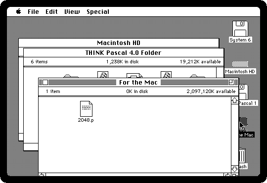

8. **Drag `2048.p` into the THINK Pascal 4.0 Folder** of the hard disk,
   where its window shows behind. The Macintosh copies it.

   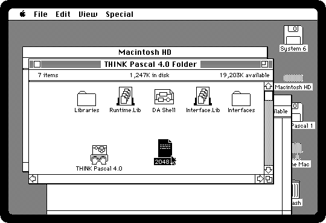

## Run it

9. **Double-click THINK Pascal 4.0.** It asks for a *project*, the list of
   what goes into a program. **Click New**, type its name, `2048.π`, and
   click *Create*. The π, typed with Option-P, was how THINK Pascal's
   projects were named.

   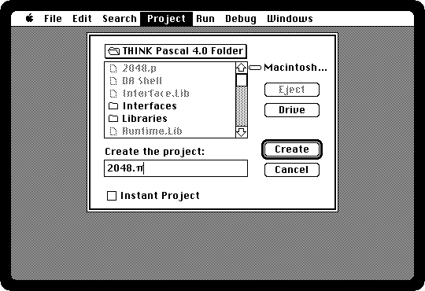

10. **Choose Add File from the Project menu**, click `2048.p` and *Add*,
    then *Done*. The project has the program, and the two libraries, which
    THINK Pascal put in it already.

    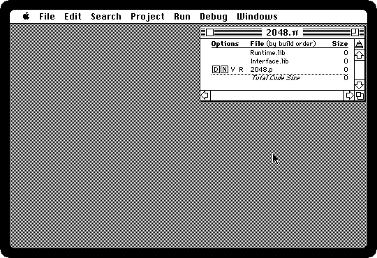

11. **Choose Open from the File menu and open `2048.p`.** THINK Pascal sets
    out the program its own way as it reads it: the words of the language in
    bold, and its own indentation.

    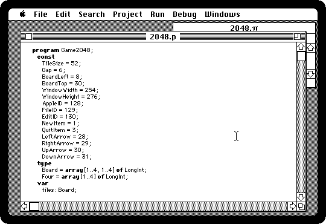

12. **Choose Go from the Run menu**, or press Command-G. THINK Pascal loads
    the libraries, compiles the program and runs it, about twenty seconds in
    all, shown here twice as fast. Its own menus are replaced by the game's
    while it runs. Play with the arrow keys.

    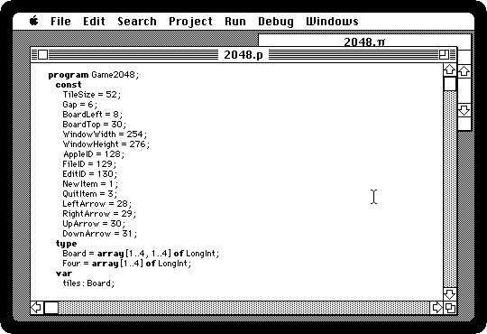

13. **Choose Quit from the game's File menu**, or press Command-Q. THINK
    Pascal is back.

## Build the application

14. **Choose Build Application from the Project menu**, type `2048` and
    click *Save*. THINK Pascal writes the game as an application of its own,
    which runs on any Macintosh without THINK Pascal. *Smart Link* leaves
    out of it the parts of the libraries the program does not use.

    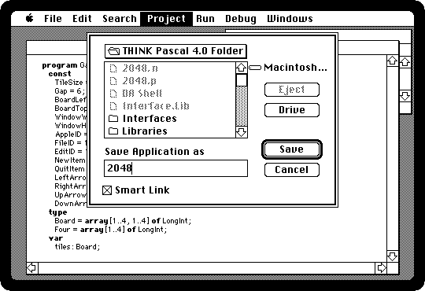

15. **Quit THINK Pascal**, from its File menu, and **click the THINK Pascal
    4.0 Folder** to bring it to the front. The application is there, with the
    plain icon of an application that has none of its own, next to the
    project. **Choose Clean Up Window from the Special menu** if their icons
    overlap.

    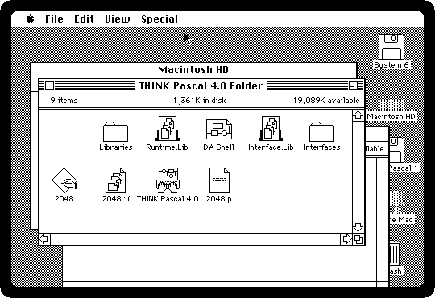

16. **Double-click 2048** and play. *About 2048* in the Apple menu says what
    it is, and the desk accessories are there too.

    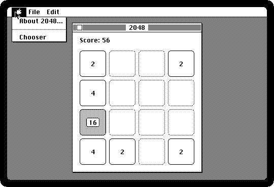

## What next

[ResEdit](resedit.md) draws icons and edits the resources of an
application, and THINK Pascal takes a resource file into the program with
the project: the game could have an icon of its own. [Programming in
BASIC](basic.md) is how most owners started programming the Macintosh.
