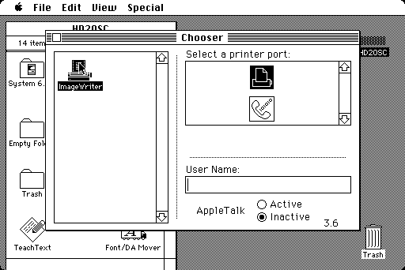

# Printing

[Back to the manual](manual.md)

izmac puts an **ImageWriter II** on the printer port. Print from the machine
the way you would have in 1986 and the page comes out as a PNG file beside the
emulator, one file per page.

```
The printer has finished a page: izmac_page_001.png
```

Nothing is written until the machine prints something, so a session that never
prints leaves nothing behind.

## Choosing the printer

The Macintosh has to be told there is a printer there, and that is done from
the machine and not from izmac. Open the **Chooser** from the Apple menu, click
the ImageWriter icon on the left, click the **printer port** icon on the right,
and close the window. Then *Print* in any application does what it says.



**The System Folder has to have the ImageWriter driver in it.** This is the
part that catches people out: a System Folder is perfectly happy without one
and gives no hint that anything is missing. The symptoms are an empty list on
the left of the Chooser, and applications answering *"unable to print this
document. Make sure you've selected a printer"*.

The driver is a file called `ImageWriter`, and it is not part of a plain System
install: on System 6 it is on the *Printing Tools* disk, and on the 6.0.8 set it
is in the Printing Folder of *System Additions*. Copy it into the System Folder
of your startup disk, from a mounted diskette or with a tool on the host, and
the Chooser finds it on the next look.

## What comes out

| | |
|---|---|
| One file per page | `izmac_page_001.png`, `izmac_page_002.png`, and on |
| The paper | eight inches of printable width on an eleven inch page |
| The resolution | 144 dots per inch, which is 1152 by 1584 pixels |

The pages of a run never print over the pages of the last one: the numbering
carries on past whatever is already there, the way an out tray fills up.
Rename the prefix with `-printerfile` to keep runs apart, or move the pages out
of the way between them.

**A Macintosh page comes out about a tenth narrower than it looks on the
screen.** That is not izmac: the screen draws 72 dots to the inch and the
printer puts them down at 80, and every Macintosh printed to an ImageWriter
this way. It is reproduced rather than corrected.

## The options

| Option | Default | Meaning |
|---|---|---|
| `-printer <what>` | `imagewriter` | `imagewriter` for pages as images, `raw` to keep the bytes, `none` for no printer at all |
| `-printerport <port>` | `printer` | the port it hangs from, `printer` or `modem` |
| `-printerfile <name>` | | what to write: the file the raw mode appends to, or the prefix the pages are named after. Each mode has its own default |

```bash
# The default, spelled out
izmac -printer imagewriter -printerfile izmac_page mydisk.img

# On the modem port, for software that was told to print there
izmac -printerport modem mydisk.img

# Keep the bytes instead of the pages
izmac -printer raw -printerfile job.bin mydisk.img
```

## The raw mode

`-printer raw` appends every byte the machine sends to a file and interprets
none of it. It is there for two reasons: it is how the ImageWriter emulation
was written — a page was printed from a real System and the decoder was written
against what came out of the port rather than against a manual — and it is the
answer for a program that drives the serial port itself and is not talking to a
printer at all.

What a job looks like, which is worth seeing once:

```
1b 3f 0d 1b 6f 1b 54 31 38 ...    ESC ? a status request, ESC T 18 the line feed
1b 4e                             ESC N the pica pitch, 80 dots to the inch
1b 46 30 30 30 37                 ESC F 0007 the head to the dot column 7
1b 47 30 30 35 30 ff 02 04 ...    ESC G 0050 and fifty columns of eight dots
1b 54 30 30 0d                    ESC T 00 and a return that does not feed
```

Every byte of a graphics run is one column of eight dots with **the bit 0 at
the top**, which is the other way round from the Epson printers of the same
period.

## What is not there

- **The LaserWriter**, and anything else on AppleTalk. A LaserWriter is not on
  a serial line but on a LocalTalk network, which needs the synchronous side of
  the serial chip that izmac does not have.
- **The printer never answers.** The driver asks for its status at the start of
  every job and carries on when nothing comes back, which is what makes this
  work at all, but a program that waits for an answer waits forever.
- **Draft quality prints in the wrong font.** The draft quality is the one
  setting where the Macintosh sends letters rather than dot graphics, and the
  glyphs of the real printer are in the real printer's ROM. The page is laid
  out correctly and the letters are legible; they are not the ImageWriter's.
  The best and faster qualities are graphics from end to end and are exact.
